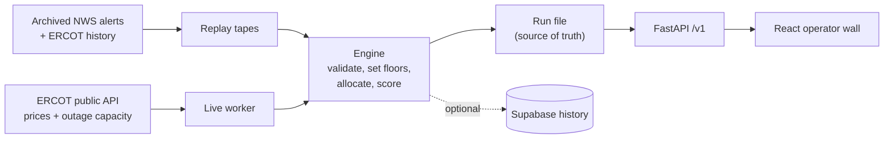

# ReserveGate

**A safety-first controller for home batteries on the Texas grid.** It sells stored power when ERCOT prices spike, and it never drains a home below the backup that home needs in a blackout.

Track: Open Grid Data (Texas grid data made useful), with an Orchestration angle: many independent homes coordinated safely when pieces fail.

[Live demo · `/flow`](https://storm-prep-signal.vercel.app/flow) · [Replay](https://storm-prep-signal.vercel.app/) · [Live](https://storm-prep-signal.vercel.app/live) · [Judges: start here](docs/humans/judges.md)

(preview, some panels use sample data) [Fleet](https://storm-prep-signal.vercel.app/fleet) · [Wall](https://storm-prep-signal.vercel.app/wall)

> The API runs on Render’s free plan. After 15 minutes idle it sleeps, so the **first load can take about a minute**. Portrait phones are supported; desktop layout is unchanged.

---

## Why this exists

Companies like Base Power put batteries in garages and sell energy back when power is expensive. That creates a conflict:

- **Selling makes money.** Every kWh sold when ERCOT is stressed counts.
- **Backup is the promise.** A family bought that battery to keep the lights on when the grid fails.

Missing a dispatch target loses revenue. Selling through a reserve on stale data can leave a family in the dark. Those mistakes are not equal.

## What it does

Every 5 minutes the engine:

1. **Reads grid stress** from ERCOT outage-capacity postings (Storm Prep), plus prices and archived NWS alerts when present.
2. **Validates the data.** Missing, stale (>90 min), malformed, or impossible feeds → risk unknown. Never “assume calm.”
3. **Sets each home’s reserve floor.** 30% calm. 60% when stress is HIGH, data can’t be trusted, or a weather alert names that county.
4. **Allocates only above the floor** across live homes. Dead, stale, or lying homes get no work.
5. **Explains itself** in a plain-language brief after the decision. Rules decide; text only explains.

**Operating rule: we may miss the target; we never break a reserve.**

## Results judges can verify

| Metric | Result |
|---|---|
| Reserve-floor breaches | **0** across tape ticks and 30 seeded random worlds (lost / duplicate / late messages, dead zones, crashing or lying homes) |
| Storm signal false alarms | Rule v2 fired on **1.7%** of out-of-sample ERCOT postings (earlier rule: **88%**) |
| Deterministic replay | Same tape → same result tick for tick; runs offline; writes nothing outside its folder |
| Tests | 750+ Python tests and 290+ web tests in CI on every push |
| Real storm replays | Winter Storm Heather and Hurricane Beryl from archived ERCOT data |

Demo tape total (illustrative):

```
run total: delivered 0.182 of 0.317 MWh (57.6%) | floor breaches 0 | hold ticks 1
```

The miss rate is intentional: storm ticks, missing-data ticks, and operator HOLD protect backup instead of chasing the target.

## Try it (60 seconds)

**In the browser (best for a judge):**

1. Open [`/flow`](https://storm-prep-signal.vercel.app/flow). Wait for the API if it’s waking up.
2. Pick **Winter Storm Heather** or **Hurricane Beryl**, press **Start**, watch 100 batteries across ERCOT’s four load zones.
3. Send a saved NWS alert and watch only named counties raise floors. In Beryl, mark Houston’s grid as down.
4. Optional on phone (portrait): same page stacks into one column; controls stay reachable. Also try [`/`](https://storm-prep-signal.vercel.app/) (Replay map), [`/live`](https://storm-prep-signal.vercel.app/live), [`/fleet`](https://storm-prep-signal.vercel.app/fleet).

**Offline on a laptop:**

```bash
python3 -m venv .venv && source .venv/bin/activate
pip install -r requirements.txt
python3 -m server.engine --tape tapes/demo.json   # one line per tick; no network; no API keys
python3 -m pytest -q
```

**Full stack locally:**

```bash
uvicorn server.app:app --reload                    # FastAPI :8000
cd web && npm install && npm run dev               # React :5173, proxies /health and /v1
python scripts/scenario_session.py                 # drives /flow and Replay
```

When both are up, the wall masthead shows `API OK`.

## How it’s built



| Layer | Technology |
|---|---|
| Engine | Python, rule-based policy, simulated device network with ack deadlines and retries |
| API | FastAPI on Render |
| Operator UI | React 19, TypeScript, Vite, Leaflet ERCOT map, on Vercel |
| History | Supabase Postgres (optional; if down, nothing stops) |
| Testing | pytest, Vitest, invariant worlds, offline replay locks, doc-drift CI |

### Engineering judgment worth a look

- **Fail safe, not fail silent.** Named failure reasons (`signal_unavailable`, `homes_stale:n`, `charge_mismatch:n`, `operator_hold`) on the affected decision. Live never quietly swaps in recorded data.
- **Distributed failures are simulated and tested.** 60s retry with the same ID; 120s book close; duplicates run once; late replies are logged, not credited.
- **Frozen contracts** in [`CONSTRAINTS.md`](CONSTRAINTS.md) so parallel work could not rename invariants mid-hackathon.
- **Removed a model that failed the 2021 Texas storm.** An outside weather-rating model was tried and dropped; the deterministic county rule stayed.
- **Honest labels.** Synthetic targets and prices are labeled on screen.

## My role

Built over the Base Power × AITX Talent Hackathon weekend (Sep 25–27, 2026) by **Uma Yeruva**, Rajat, and Sunny. I owned the repository and merges, and I built:

- **Storm Prep signal** — research, backtested risk rule, live ERCOT fetch, rejection of stale data
- **Frozen contracts and reserve policy** — `CONSTRAINTS.md`, risk-driven floors, per-zone / per-county weather floors
- **Real-event replay** — Heather and Beryl from Supabase history, plus offline deterministic replay tests
- **`/flow` grid page and deploy** — scenario tapes, charging, grid down, alerts; wall on Vercel; API + session worker on Render
- **System design docs** with CI that fails when docs drift from code

## Honest limits

Homes and the device network are simulated; no real battery is controlled. Demo-tape targets and prices are labeled synthetic. The 15% storm margin was tuned on one month of data and has not been validated. Full list: [judges page](docs/humans/judges.md#6-honest-limits).

Phone support is **portrait-only CSS** under `max-width: 720px`. Desktop layout is intentionally unchanged. Not a PWA or native iOS app. Detail: [`docs/humans/mobile.md`](docs/humans/mobile.md).

## Repository map

| Path | What’s there |
|---|---|
| `server/engine/` | Tick loop, signal validation, policy, allocator, fleet, scoring |
| `server/` | FastAPI app and `/v1` routes |
| `web/` | React wall, Replay, Live, Fleet, `/flow` |
| `tapes/` | Demo, failure, and real-storm replay tapes |
| `scripts/` | ERCOT / NWS fetchers, backtests, scenario session worker |
| `supabase/` | Database migrations |
| `docs/humans/` | One-minute pages for people |
| `docs/agents/` | Detailed design notes |
