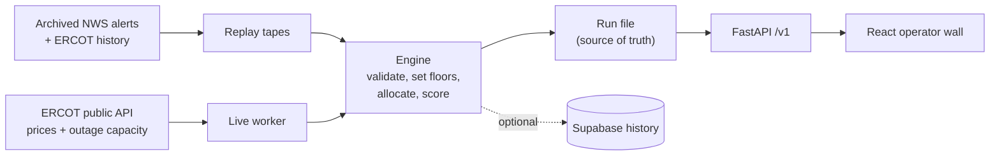

# ReserveGate

**A safety-first controller for home batteries on the Texas grid. It sells stored power when ERCOT prices spike, but it never drains a home below the backup that home needs during a blackout.**

[Live demo](https://storm-prep-signal.vercel.app/flow) · [Judges: start here](docs/humans/judges.md) · [System design](docs/agents/system-design.md) · [Code flow](docs/agents/code-flow.md)

> The demo runs on Render's free plan. If nobody has used it for 15 minutes the API is asleep, so the first load can take about a minute.

---

## The problem

Companies like Base Power put batteries in people's garages and sell that energy back to the grid when power is expensive. That creates a conflict:

- **Selling makes money.** When ERCOT asks for power or prices spike, every kWh sold counts.
- **Backup is the promise.** A family bought that battery to keep the lights on when the grid fails. If you empty it for profit right before a winter storm, the product has failed.

The data behind that decision is often late, missing, or wrong. The two possible mistakes don't cost the same. Missing a dispatch target loses some revenue. Selling through a reserve because of stale data can leave a family in the dark.

## What ReserveGate does

Every 5 minutes, the engine:

1. **Reads grid stress** from ERCOT's public outage-capacity postings (the Storm Prep signal), plus live prices and any saved National Weather Service alerts.
2. **Validates the data.** If a feed is missing, stale (older than 90 minutes), malformed, or impossible, the engine treats the risk as unknown. It never falls back to "normal."
3. **Sets each home's reserve floor.** 30% on calm days. 60% when stress is HIGH, when the data can't be trusted, or when a weather alert names that county.
4. **Splits the grid's request** across live homes, using only the energy above each floor. Homes that are dead, stale, or lying about their charge get no work.
5. **Explains itself.** It writes a plain-language brief after every decision. Rules decide; text only explains.

The operating rule: **we may miss the target; we never break a reserve.**

## Results

| Metric | Result |
|---|---|
| Reserve-floor breaches | **0** across every tape tick and 30 seeded random worlds that include lost, duplicate, and late messages, dead zones, and crashing or lying homes |
| Storm signal false alarms | Rule v2 fired on **1.7%** of out-of-sample ERCOT postings. The earlier rule fired on **88%**. |
| Deterministic replay | The same tape produces the same result tick for tick, runs fully offline, and writes nothing outside its own folder. |
| Test suite | 750+ Python tests and 292 web tests, run in CI on every push |
| Real storm replays | Winter Storm Heather and Hurricane Beryl, replayed from archived ERCOT data |

The demo tape ends like this:

```
run total: delivered 0.182 of 0.317 MWh (57.6%) | floor breaches 0 | hold ticks 1
```

The 57.6% is on purpose. During the storm ticks, the missing-data tick, and the operator hold, the engine protects backup instead of chasing the target.

## Try it

**In the browser:** open [`/flow`](https://storm-prep-signal.vercel.app/flow). Pick Winter Storm Heather or Hurricane Beryl, press Start, and watch 100 batteries across ERCOT's four load zones respond. Send a saved NWS alert and watch only the named counties raise their floors. In Beryl, mark Houston's grid as down.

**On your laptop, offline, in about 60 seconds:**

```bash
python3 -m venv .venv && source .venv/bin/activate
pip install -r requirements.txt
python3 -m server.engine --tape tapes/demo.json   # one line per tick, no network, no API keys
python3 -m pytest -q
```

**Full stack locally (API and operator wall):**

```bash
uvicorn server.app:app --reload                    # FastAPI on :8000
cd web && npm install && npm run dev               # React wall on :5173, proxies /health and /v1 to :8000
python scripts/scenario_session.py                 # optional: drives the /flow page
```

When both are running, the wall's header shows `API OK`.

**ERCOT day-ahead (DAM) prices (optional, needs keys):**

```bash
python scripts/fetch_dam_prices.py 2026-08-30 2026-08-31   # ERCOT_* in .env, full network; saves data/fixtures/dam/, exits 1 if a day fails
python scripts/backtest_dam.py                             # SUPABASE_* in .env; DAM-chosen hours vs real-time, always exits 0
```

Setup, output, verification, and failure recovery: [`docs/agents/dam-forecast.md`](docs/agents/dam-forecast.md#scripts).

## How it's built



| Layer | Technology |
|---|---|
| Engine and signal | Python 3.12, rule-based policy, a simulated device network with acknowledgment deadlines and retries |
| API | FastAPI and Uvicorn, deployed on Render |
| Operator wall | React 19, TypeScript, Vite, Leaflet map of ERCOT load zones, deployed on Vercel |
| History | Supabase Postgres with row-level security. It's optional: if it's down, nothing stops. |
| Testing | pytest, Vitest, invariant tests over randomized worlds, network-blocking offline replay tests, and doc-drift checks in CI |

### Engineering decisions worth a look

- **Fail safe, not fail silent.** Every failure type has a name (`signal_unavailable`, `homes_stale:n`, `charge_mismatch:n`, `operator_hold`) and is printed on the decision that was affected. Live mode never quietly swaps in recorded data.
- **Distributed-systems failures are simulated and tested.** Commands time out at 60 seconds and retry with the same ID. Duplicates run once. Replies that arrive after the 120-second close are logged but not counted. A home that reports more energy than its battery gave is booked at the real charge drop.
- **Frozen contracts.** Tick shapes and invariants live in [`CONSTRAINTS.md`](CONSTRAINTS.md), so three people and their coding agents could work in parallel without breaking each other.
- **Removed a model that got it wrong.** We tested an outside model (JEV) for rating weather alerts. It rated the 2021 Texas winter storm as not dangerous, so we took it out and kept the deterministic county rule.
- **Honest numbers.** Every synthetic value is labeled on screen. The limits are listed below instead of hidden.

## My role

ReserveGate was built over one hackathon weekend (September 25–27, 2026) by a team of three: **Uma Yeruva**, Rajat, and Sunny. I owned the repository and merges, and I built:

- **The Storm Prep signal:** the research, the backtested risk rule, the live ERCOT fetch, and rejection of stale data.
- **The frozen contracts and reserve policy:** `CONSTRAINTS.md`, reserve floors driven by risk, and per-zone and per-county floors driven by weather alerts.
- **Real-event replay:** loading Winter Storm Heather and Hurricane Beryl from Supabase history, plus the tests that prove replays are offline and deterministic.
- **The `/flow` grid page and deployment:** scenario tapes, charging, grid down, and alerts, with the wall on Vercel and the API plus the session worker on Render.
- **System design documentation,** with a CI check that fails whenever the docs drift from the code.

## Honest limits

The homes and the device network are simulated; no real battery is controlled. Targets and prices on the demo tape are labeled synthetic. The 15% storm margin was tuned on one month of data and has not been validated. The full list is in the [judges page](docs/humans/judges.md#6-honest-limits).

## Repository map

| Path | What's there |
|---|---|
| `server/engine/` | Tick loop, signal validation, policy, allocator, fleet, scoring |
| `server/` | FastAPI app and `/v1` routes |
| `web/` | React operator wall, fleet list, and `/flow` grid page |
| `tapes/` | Demo, failure, and real-storm replay tapes, each with a provenance file |
| `scripts/` | ERCOT and NWS fetchers, backtests, the scenario session worker |
| `supabase/` | Database migrations |
| `docs/humans/` | One-minute pages for people |
| `docs/agents/` | Detailed design notes |
