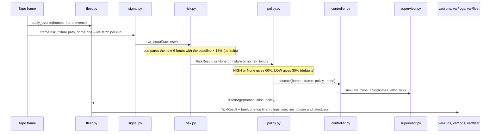
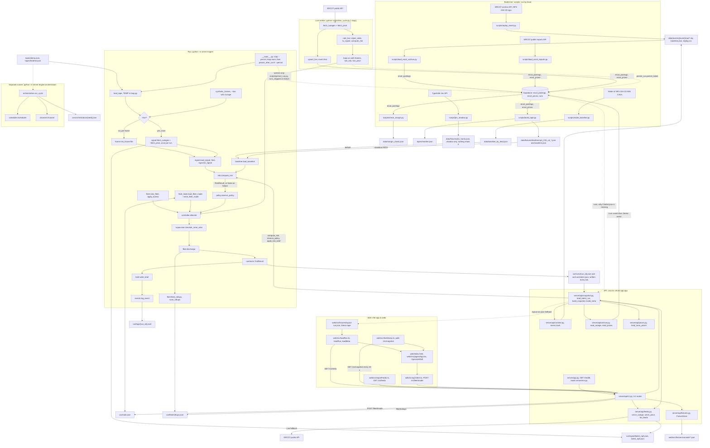
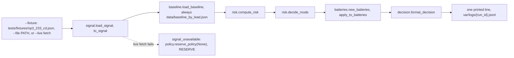

# Code flow

**Decision.** This file is the one home for how a run moves through the code. It was traced from the source on 2026-09-26, after PR #7 (controller lane) and PR #9 (live worker) merged, not from older docs.

**Summary.**

- One entry point makes a run: `python -m server.engine` (`server/engine/__main__.py` calls `loop.main`, then `scripts/persist_run.py` only with `--persist`). It plays a tape, rates risk for each frame, picks the reserve floor, splits the target across homes, simulates zone acks, discharges, and writes `var/runs/<run_id>.json` plus `var/runs/latest.json` after every tick. That run file is the source of truth.
- Upstream, `scripts/` load ERCOT history into Supabase and build local files: tapes, posting fixtures, baselines, and evidence JSON. `data/fixtures/heather/` and `tapes/heather.json` are built by `scripts/build_tape.py`.
- For Live, `scripts/live_cycle.py` is the laptop worker: each cycle it fetches ERCOT, upserts the posting and price into Supabase as `event=live`, and calls `loop.run()` for one tick with that same posting.
- The API (`uvicorn server.app:app`) reads the run file and Supabase (through `server/api/archive.py`: the newest `event=live` row in Live, the pinned posting for Demo with an archive event). In Live it falls back to ERCOT directly (through `server/api/feeds.py`) when no worker row is usable. It rates the posting again with the engine's `compute_risk` and `reserve_policy`; it never writes a second rule. See [PROJECT_CONTEXT.md, Supabase](PROJECT_CONTEXT.md#supabase-optional-history-never-required).
- The wall (`web/index.html`) shows the layout tape in Demo and polls `GET /v1/snapshot` in Live and archive mode. It does not read `var/runs/` directly.
- A second entry point, `python -m server.engine.cli`, rates one ERCOT posting and prints one decision line. A third, `python -m server.engine.orchestration`, is Rajat's lossy-channel runtime; `loop.py` does not call it yet.

Keep this file current: `.cursor/rules/code-flow.mdc` says when, and `tests/test_code_flow.py` fails when a module or `web/src/` folder is missing from the file map below.

## 0. At a glance

Dashed arrows are optional or best effort; section 1 has the full detail.

```mermaid
flowchart LR
  subgraph build["1. Build time, run by hand"]
    ARCHAPI["ERCOT archive API"]
    RPTAPI["ERCOT reports API"]
    MIS["NP3-233-CD MIS CSVs"]
    REPLAY["replay_event.py"]
    EVENTS["data/events/{event}/"]
    ARCH["load_ercot_archive.py"]
    REPORTS["load_ercot_reports.py"]
    MAKEB["make_baseline.py"]
    SB[("Supabase<br/>ercot_postings<br/>ercot_prices<br/>runs")]
    CHECK["check_margin.py"]
    BUILD["build_tape.py"]
    ARCHAPI --> REPLAY --> EVENTS --> ARCH --> SB
    RPTAPI --> REPORTS --> SB
    MIS --> MAKEB
    SB --> CHECK
    SB --> BUILD
  end

  subgraph files["2. Local files"]
    TAPES["tapes/heather.json<br/>tapes/demo.json, hand-written"]
    FIX["data/fixtures/heather/<br/>postings + baseline.json"]
    BASE["data/baseline_by_lead.json"]
    MARGIN["data/margin_check.json<br/>evidence only"]
  end

  BUILD --> TAPES
  BUILD --> FIX
  MAKEB --> BASE
  CHECK --> MARGIN

  subgraph engine["3. python -m server.engine"]
    LOOP["loop.py<br/>one pass per tape frame"]
    RISK["signal → risk.compute_risk"]
    POL["policy.reserve_policy<br/>30% or 60% floor"]
    ALLOC["controller.allocate<br/>supervisor.simulate_zone_acks<br/>fleet.discharge"]
    LOOP --> RISK --> POL --> ALLOC
  end

  TAPES --> LOOP
  FIX -->|"risk_fixture, --baseline"| RISK
  BASE -->|default baseline| RISK

  RUN["var/runs/latest.json<br/>source of truth"]
  ROLL["var/fleet/rollups.json"]
  STATE["var/state.json<br/>AUTO or HOLD"]
  ALLOC --> RUN
  ALLOC --> ROLL
  STATE <--> LOOP
  RUN -.->|"persist_run.py, --persist only, best effort"| SB

  LIVEW["scripts/live_cycle.py<br/>laptop worker, --loop"]
  ERCOTW["ERCOT public API"]
  ERCOTW --> LIVEW
  LIVEW -->|"upsert event=live"| SB
  LIVEW -->|"loop.run, one tick"| LOOP

  subgraph api["4. API, uvicorn server.app:app"]
    V1["server/api/v1.py"]
    SNAP["snapshot.py<br/>re-rates the posting"]
    FEEDS["feeds.py → ERCOT<br/>Live fallback, cache in var/signal/"]
    ARCHR["archive.py<br/>Live: event=live row<br/>Demo: pinned event"]
    V1 --> SNAP
    SNAP --> FEEDS
    SNAP --> ARCHR
  end

  RUN --> SNAP
  ROLL --> V1
  V1 -->|"POST /v1/fleet/mode"| STATE
  ARCHR --> SB

  subgraph web["5. Wall, web/"]
    WALL["App.tsx → OperatorWall"]
    LAYOUT["fixtures/layout-run.json<br/>Demo tape"]
  end

  LAYOUT --> WALL
  WALL -->|"GET /v1/snapshot every 20 s, /v1/meta, /v1/feeds"| V1
```

One engine tick (`run()` in `server/engine/loop.py`):

## 1. Full flow

Solid arrows exist in code today. Dashed arrows are optional, best effort, or not wired into the tick loop.

How one engine tick runs, in order (`run()` in `server/engine/loop.py`):

1. `start_run(var/logs)` opens `var/logs/<run_id>.jsonl`. `with_fleet_defaults` fills SOC and zone settings a short test dict may lack.
2. `load_baseline(baseline_path)`. The default is `data/baseline_by_lead.json`. `--baseline PATH` rates a past storm against the month before it, for example `data/fixtures/heather/baseline.json`. A missing or short baseline raises `BaselineError` and stops the run.
3. With `--live`, `read_live_risk` fetches NP3-233-CD once and uses that risk on every tick. If it succeeded, `read_live_price` fetches NP6-905-CD once. A failed fetch gives risk `None` on every tick and no price.
4. Frames come from `load_tape(--tape)`, or from `synthetic_frames` when `--live` has no tape (12 frames at 0.2 MW, labeled `synthetic`). `new_fleet(settings)` seeds the homes. The mode starts from `var/state.json` (`AUTO` when the file is missing).
5. For each frame: `apply_events`. Then risk: the live risk, or `read_risk(frame.risk_fixture)`, which calls `signal.load_signal`, then `signal.to_signal`, then `risk.compute_risk`. Any failure is logged and gives `None`. A frame with no `risk_fixture` also gives `None`.
6. `reserve_policy(risk, settings)`. `None` means the storm floor with reason `signal_unavailable`.
7. The mode comes from `frame.events["operator"]`, else the current mode, and is written back to `var/state.json`. `scale_target_mw` scales the target to the fleet. Then `allocate`, `simulate_zone_acks`, and `discharge` (which returns the breach count).
8. Build a `TickResult` (with zone floors, zone delivered MW, zone acks, and price), call `write_brief`, then `log_event("tick", ...)` and print one line.
9. Write `var/fleet/rollups.json`, then the run record (`run_id`, `tape`, `source`, `baseline`, `settings`, `ticks`, `totals: {}`) to `var/runs/<run_id>.json` and `var/runs/latest.json`. This happens every tick, so `/v1/snapshot` can read a live run mid-way.
10. `__main__.py` strips `--persist` from argv (`parse_known_args`) before `loop.main`. Only with `--persist`, after `loop.main` returns, it calls `scripts/persist_run.py` to upsert the run into Supabase `runs`. Any failure prints `runs_skipped: <reason>` and the exit code is unchanged. Without the flag, `--tape` makes no network calls.

How `GET /v1/snapshot` builds one tick for the wall (`server/api/snapshot.py`):

1. `load_latest_run()`: `var/runs/latest.json`, else a non-empty Supabase `runs` row, else `web/src/fixtures/layout-run.json`.
2. Take the last tick and scale it to the fleet. `runtime.discover_runtime` decides live, archive, or fixture from `?event=`, `?clock=`, and `data/events/<event>/replay.csv`.
3. Live: first `archive_ingest(event="live")` reads the newest `event=live` posting that `scripts/live_cycle.py` upserted (stale after 90 minutes). If that fails, `feeds.serve_outage` and `serve_price` fetch ERCOT (keys stay on the server), cache the last good body in `var/signal/`, and fall back to it inside 90 minutes (outage) or 30 minutes (price). Archive: `archive.read_outage` and `read_prices` read Supabase at the pinned clock.
4. Rate the posting with `compute_risk` and `reserve_policy`, bind zone prices with `prices.bind_zone_prices`, apply the operator mode from `var/state.json`, and add the brief with `apply_tick_brief`. A failure returns the tick with a named quality (`auth`, `stale`, `unavailable`) and the storm floor.

## 2. Other entry points

### One-shot risk check

`python -m server.engine.cli --fixture | --file PATH | --live` (`server/engine/cli.py`). One pass, no tape, no fleet.

- Modules used: `signal`, `baseline`, `risk` (`compute_risk`, `decide_mode`), `batteries`, `decision`, `events`, and `policy` (only on the live-failure path).
- `batteries.py`, `decision.py`, and `risk.decide_mode` are used only by the CLI, not by the tick loop.
- `cli.read_settings()` is the one settings reader. The tick loop, `snapshot.py`, `orchestration.py`, and `scripts/replay_event.py`, `check_margin.py`, and `build_tape.py` all import it from `cli.py`.
- Only `--live` fails safe. File-mode errors and a broken baseline are raised.

### Live worker

`python scripts/live_cycle.py [--loop] [--dry-run]`. One cycle: `fetch_outages` and `fetch_price` (a price failure is `None`, not a hold), `upsert_live` into `ercot_postings` and `ercot_prices` as `event=live` (best effort, never deletes archive weeks), `rate_live` on that same posting (stale or broken gives `None`, so the storm floor), then `loop.run(None, ..., live=True, frames=[one 0.40 MW synthetic frame], live_risk=..., live_price=...)` so the engine does not fetch twice. Then `persist_run.persist_latest`. `--loop` repeats every `tick_minutes`; `--dry-run` sends nothing to Supabase. It always uses the default baseline. Detail: `docs/agents/live-ingest.md`.

### Orchestration runtime

`python -m server.engine.orchestration --tape PATH --seed N` (`server/engine/orchestration.py`). Plays a tape through `allocate`, then fans each tick's commands out through zone supervisors and a lossy `channel.Channel` to one worker per home, on the seeded virtual clock in `scheduler.py`. Deadlines at 0, 60, and 120 s; a retry keeps the command id; a reassignment gets a new one. Writes `var/orchestration/<seed>.json`. `loop.py` does not call it; the tick loop uses the in-process `supervisor.simulate_zone_acks` rollup instead. Detail: `docs/agents/epic-3-controller.md`.

## 3. File map

Engine and API (`server/`):

- `server/app.py`: FastAPI app. Calls `server/env.py`, sets CORS, serves `GET /health`, mounts the `/v1` router, holds `ConsoleState` in memory.
- `server/env.py`: `load_env`. Reads `server/.env`, then leaves process env in place so Render and the shell win.
- `server/api/v1.py`: the `/v1` routes. `/meta`, `/snapshot`, `/runs/latest`, and `/feeds*` read the run file, ERCOT, and Supabase through the modules below. `/fleet/rollups` reads `var/fleet/rollups.json`. `/live`, `/zone`, `/homes`, `/ticks`, and `/tapes` still read `FixtureStore`. `POST /fleet/mode` writes `var/state.json`; other writes change only in-memory state. Every write needs `X-Operator-Id`.
- `server/api/snapshot.py`: `load_latest_run`, `build_meta`, and `build_snapshot`. Re-rates the newest posting with the engine's `compute_risk` and `reserve_policy`.
- `server/api/runtime.py`: the weekend replay clock. `discover_runtime` and `posting_at` read `data/events/<event>/replay.csv`.
- `server/api/feeds.py`: the ERCOT proxy. `serve_outage` and `serve_price` fetch, cache in `var/signal/`, and grade quality. `list_feeds` builds the Feeds panel catalog from Supabase history plus cache quality.
- `server/api/archive.py`: reads `ercot_postings` and `ercot_prices` for Demo with an archive event. `ArchiveUnavailable` on a missing config or failed call.
- `server/api/prices.py`: binds NP6-905-CD rows to the four load zones. `fetch_archive_prices` fills the three zones live NP6 does not return.
- `server/api/fixtures.py`: `FixtureStore`. Reads `web/src/fixtures/console/<name>.json` on every call (`CONSOLE_FIXTURES_DIR` overrides the folder).
- `server/engine/__main__.py`: `python -m server.engine` calls `loop.main`, then `persist_after_run` only with `--persist`.
- `server/engine/loop.py`: the tick loop. Parses arguments, holds the TEMP `load_tape`, and writes the run record every tick.
- `server/engine/cli.py`: the one-shot risk CLI and `read_settings()`, which reads `.env`.
- `server/engine/signal.py`: the ERCOT NP3-233-CD and NP6-905-CD fetches, the stale check, `load_signal`, and `to_signal`.
- `server/engine/baseline.py`: `load_baseline`, `BaselineError`, `BASELINE_PATH`, and `baseline_span`.
- `server/engine/risk.py`: `compute_risk` (pure) returns a `RiskResult`. `decide_mode` is used by the CLI only.
- `server/engine/policy.py`: `reserve_policy` (pure). Sets the fleet floor and per-zone floors.
- `server/engine/contracts.py`: the shared dataclasses `Home`, `TapeFrame`, `Policy`, `Allocation`, and `TickResult`.
- `server/engine/fleet.py`: `new_fleet`, `apply_events`, `discharge`, the floor math (`floor_kwh`, `safe_kw`), target scaling, and the zone rollups (`fleet_rollups`, `save_rollups`, `current_rollups`).
- `server/engine/controller.py`: `allocate` (pure). Splits the target using only energy above each home's floor.
- `server/engine/supervisor.py`: `simulate_zone_acks`. Rolls acked, held, silent, dead, and unconfirmed per zone after `allocate`. No device API.
- `server/engine/fleet_state.py`: reads and writes `var/state.json` so the wall's `AUTO`/`HOLD` and the next `allocate` share one mode.
- `server/engine/brief.py`: `write_brief` and `apply_tick_brief`. One or two sentences from `TickResult` fields. No LLM.
- `server/engine/score.py`: `new_board` and `update`, the running scoreboard. Only tests import it; `loop.py` still writes `totals: {}`.
- `server/engine/orchestration.py`: the separate lossy-channel runtime (`run_cycle`, `ZoneSupervisor`, `HomeWorker`). Writes `var/orchestration/<seed>.json`.
- `server/engine/scheduler.py`: the seeded virtual clock and event queue used by `orchestration.py`.
- `server/engine/channel.py`: the seeded lossy channel (drop, delay, duplicate, late) used by `orchestration.py`.
- `server/engine/events.py`: `start_run` and `log_event`. The only writer of the JSONL event log.
- `server/engine/batteries.py`: three simulated batteries, used by the CLI only.
- `server/engine/decision.py`: `format_decision`, the CLI's one-line summary.

Scripts (`scripts/`):

- `scripts/replay_event.py`: downloads NP3-233-CD archive zips for a storm week plus 30 days before it, builds that event's baseline, and rates each posting. Writes `data/events/<event>/raw/*.zip`, `baseline.json`, and `replay.csv`.
- `scripts/make_baseline.py`: turns a folder of MIS CSVs into `data/baseline_by_lead.json`. Its helpers are shared by `replay_event.py`, `load_ercot_archive.py`, and `check_margin.py`.
- `scripts/load_ercot_archive.py`: upserts the saved zips from `data/events/<event>/raw/` into Supabase `ercot_postings`. It makes no ERCOT API call. Its `send` helper is reused by `persist_run.py`.
- `scripts/load_ercot_reports.py`: pulls ERCOT reports from the public API into Supabase. Postings go to `ercot_postings`, NP6-905-CD prices go to `ercot_prices`. It skips Beryl and Heather NP3-233-CD, which came from the archive.
- `scripts/check_margin.py`: reads `ercot_postings`, rates every posting at several margins with `compute_risk`, and writes `data/margin_check.json`.
- `scripts/build_tape.py`: reads Heather's postings and prices from Supabase. Writes `tapes/heather.json`, `data/fixtures/heather/np3_233_cd_<posted>.json`, and `data/fixtures/heather/baseline.json`. It reuses `check_margin`'s fetch and baseline code.
- `scripts/persist_run.py`: upserts `var/runs/latest.json` into Supabase `runs`. Called by `server/engine/__main__.py` (with `--persist`) and `scripts/live_cycle.py` after every run; also runnable by hand. Best effort.
- `scripts/live_cycle.py`: the Live worker. Fetches ERCOT, upserts `event=live` rows, runs one `loop.run()` tick with that posting, then persists the run. Reuses `load_ercot_reports.posting_rows` and `price_rows` and `load_ercot_archive.send`.
- `scripts/jev_shadow.py`: asks TypeSafe Jev one question about an NWS alert and writes `data/fixtures/jev_harris.json`. Shadow only: no engine code reads it.

Wall (`web/src/`, top-level folders):

- `web/src/api/`: `health.ts` polls `GET /health`. `client.ts` is the `/v1` client; `OperatorWall` uses it for `POST /v1/fleet/mode`.
- `web/src/components/`: atoms, molecules, organisms, and templates. `templates/OperatorWall.tsx` is the wall.
- `web/src/design/`: design tokens (`tokens.css`) and the design notes.
- `web/src/domain/`: `/v1` types, parsers, and helpers for the console pages.
- `web/src/features/`: the `wall/`, `fleet/`, and `history/` console pages, served by `web/wall.html`, `fleet.html`, and `history.html`. They render `preview-data.ts`, not the API or a run file.
- `web/src/fixtures/`: `console/*.json` (read by `server/api/fixtures.py` and the web tests), `layout-run.json` (the Demo tape, and the API's last fallback run), and `scenes.ts`.
- `web/src/pages/`: `App.tsx`, mounted by `web/index.html` through `web/src/main.tsx`. Calls `loadRun()` and renders `OperatorWall`.

Top-level files in `web/src/` that matter for the flow: `loadRun.ts` (`loadRun` returns `fixtures/layout-run.json`; `loadMeta` reads `GET /v1/meta`), `liveStamp.ts` (polls `GET /v1/snapshot`), `reportFeeds.ts` (reads `GET /v1/feeds`), `runtimeMode.ts` and `wallOrigin.ts` (Demo, archive, or Live), `contracts.ts` (TypeScript copy of the run-file fields; `contracts.py` wins if they disagree), and `main.tsx`.

## 4. Data files per step

| Step | Reads | Writes |
|---|---|---|
| `scripts/replay_event.py` | ERCOT archive API (needs `ERCOT_*` in `.env`) | `data/events/<event>/raw/*.zip`, `data/events/<event>/baseline.json`, `data/events/<event>/replay.csv` |
| `scripts/make_baseline.py` | a folder of `cdr.00013103.*.HRLYRESOUTCAPNP3233.csv` | `data/baseline_by_lead.json` |
| `scripts/load_ercot_archive.py` | `data/events/<event>/raw/*.zip` | Supabase `ercot_postings` |
| `scripts/load_ercot_reports.py` | ERCOT public reports API | Supabase `ercot_postings`, `ercot_prices` |
| `scripts/check_margin.py` | Supabase `ercot_postings` | `data/margin_check.json` |
| `scripts/build_tape.py` | Supabase `ercot_postings`, `ercot_prices` | `tapes/heather.json`, `data/fixtures/heather/np3_233_cd_*.json`, `data/fixtures/heather/baseline.json` |
| `scripts/persist_run.py` | `var/runs/latest.json`, `var/signal/latest_np3.json`, Supabase `ercot_postings` | Supabase `runs` |
| `scripts/live_cycle.py` | `.env`, ERCOT API, `data/baseline_by_lead.json`, `var/state.json` | Supabase `ercot_postings`, `ercot_prices` (`event=live`), `runs`; `var/logs/<run_id>.jsonl`, `var/runs/<run_id>.json`, `var/runs/latest.json`, `var/fleet/rollups.json`, `var/signal/latest_np3.json`, `latest_np6.json` |
| `scripts/jev_shadow.py` | `tests/fixtures/nws_alert_harris.json` if present, the Jev API | `data/fixtures/jev_harris.json` |
| `python -m server.engine` | `.env`, `--tape` file, each frame's `risk_fixture`, `--baseline` file (default `data/baseline_by_lead.json`), `var/state.json`; `--live`: ERCOT API | `var/logs/<run_id>.jsonl`, `var/runs/<run_id>.json`, `var/runs/latest.json`, `var/fleet/rollups.json`, `var/state.json`; `--live`: `var/signal/latest_np3.json`, `latest_np6.json`; then Supabase `runs` |
| `python -m server.engine.orchestration` | `.env`, `--tape` file | `var/orchestration/<seed>.json` |
| `python -m server.engine.cli` | `.env`, `tests/fixtures/np3_233_cd.json` or `--file` or the ERCOT API, `data/baseline_by_lead.json` | `var/logs/<run_id>.jsonl`; `--live`: `var/signal/latest_np3.json` |
| `uvicorn server.app:app` | `server/.env`, `var/runs/latest.json` (else Supabase `runs`, else `layout-run.json`), `var/fleet/rollups.json`, `var/state.json`, `data/events/<event>/replay.csv`, ERCOT API, Supabase `ercot_postings` and `ercot_prices`, `web/src/fixtures/console/*.json` | `var/signal/latest_np3.json`, `latest_np6.json`, `var/state.json` |
| wall (`web/index.html`) | `web/src/fixtures/layout-run.json`; `GET /v1/meta`, `/v1/snapshot`, `/v1/feeds`, `/health` | `POST /v1/fleet/mode` |

`var/` is gitignored. `data/events/*/raw/` and all of `data/events/heather/` are gitignored too.

## 5. Stubs and gaps

- **`load_tape` is still TEMP in `server/engine/loop.py`.** A plain JSON read that does not check labels, offsets, or a naive `ts`. It waits on Sunny's `server/engine/tape.py`, which does not exist. The promised signature is in [CONSTRAINTS.md, Function contracts](../../CONSTRAINTS.md#function-contracts).
- **`totals` stays `{}`.** `score.py` exists, but `loop.py` does not call `new_board` or `update` yet.
- **Two ack models.** The tick loop uses `supervisor.simulate_zone_acks` (in-process rollup). `orchestration.py` is the full lossy-channel runtime and is not wired into `loop.py`.
- **Some `/v1` routes still read fixtures.** `/live`, `/zone`, `/homes`, `/ticks`, `/tapes`, and the `/live/stream` tick event come from `web/src/fixtures/console/*.json`. Only `/fleet/mode` reaches the engine (through `var/state.json`); attention and playback writes stay in memory.
- **The `features/` console pages render preview data.** They do not call `/v1` or read a run file.
- **Weather is not wired.** `loop.py` never passes `alerted` to `reserve_policy` and never reads `TapeFrame.weather_fixture`, so `weather_label` stays `"none"`.
- **Run record.** It has no `decision_line`, although step 2 of "Backend" in `CONSTRAINTS.md` lists one. It carries an extra `baseline` key.

## 6. Owners

Each box above belongs to the owner of its file, listed in [CONSTRAINTS.md, Files and owners](../../CONSTRAINTS.md#files-and-owners-one-owner-per-file-nobody-else-edits-it). That table is not copied here. `scripts/` and `data/` are not listed in it. Ask the owner of `CONSTRAINTS.md` before changing them.

## 7. Supabase

Scripts write `ercot_postings` and `ercot_prices` (`load_ercot_archive.py`, `load_ercot_reports.py`) and read them (`check_margin.py`, `build_tape.py`). At run time, `scripts/live_cycle.py` upserts `event=live` postings and prices, `server/api/archive.py` reads the newest `event=live` row for Live and the pinned posting for Demo with an archive event, `server/api/feeds.py` reads the latest posting per report for the Feeds panel, and `scripts/persist_run.py` writes `runs` after an engine run started with `--persist` and after each live cycle. The engine's tick loop never imports Supabase, and a failure never blocks a run or the wall. Rules and keys: [PROJECT_CONTEXT.md, Supabase](PROJECT_CONTEXT.md#supabase-optional-history-never-required).
