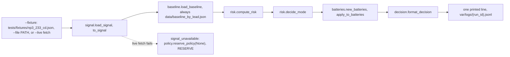

# Code flow

**Decision.** This file is the one home for how a run moves through the code. It was traced from the source on 2026-09-26, after PR #7 (controller lane) and PR #9 (live worker) merged, not from older docs.

**Summary.**

- One entry point makes a run: `python -m server.engine` (`server/engine/__main__.py` calls `loop.main`, then `scripts/persist_run.py` only with `--persist`). It plays a tape, rates risk for each frame, picks the reserve floor, splits the target across homes, sends each order through the orchestrator (lossy channel, retry, deadline; only confirmed MW counts), rolls up zone acks, writes `var/fleet/tick_emit.json` (whole-fleet controller emit) every tick, and writes `var/runs/<run_id>.json` plus `var/runs/latest.json` after every tick. That run file is the source of truth for the wall. Only a live run loads `var/fleet/homes.json` and saves it after every tick, so the next live run starts from the same SOC; a `--tape` or synthetic replay starts from a fresh fleet and never touches that file.
- Upstream, `scripts/` load ERCOT history into Supabase and build local files: tapes, posting fixtures, baselines, and evidence JSON. `data/fixtures/heather/` and `tapes/heather.json` are built by `scripts/build_tape.py`.
- For Live, `scripts/live_cycle.py` is the laptop worker: each cycle it fetches ERCOT, upserts the posting and price into Supabase as `event=live`, hydrates HOLD / AUTO from `public.operator_settings` onto `var/state.json`, and calls `loop.run()` for one tick with that same posting.
- The API (`uvicorn server.app:app`) reads the run file and Supabase (through `server/api/archive.py`: the newest `event=live` row in Live, the pinned posting for Demo with an archive event). In Live it falls back to ERCOT directly (through `server/api/feeds.py`) when no worker row is usable. It rates the posting again with the engine's `compute_risk` and `reserve_policy`; it never writes a second rule. See [PROJECT_CONTEXT.md, Supabase](PROJECT_CONTEXT.md#supabase-optional-history-never-required).
- The wall (`web/index.html`) shows the layout tape in Demo and polls `GET /v1/snapshot` in Live and archive mode. It does not read `var/runs/` directly.
- For `/flow`, `scripts/scenario_session.py` is the scenario worker (laptop, or beside uvicorn on Render): it reads operator requests from `var/scenario/requests.json` (appended by `server/api/scenario.py`), plays one frame of a `tapes/scenarios/` tape through `loop.play_frame` with its own seeded fleet, and writes `var/scenario/state.json` for `GET /v1/scenario/state`. Detail: [grid-flow.md](grid-flow.md).
- A second entry point, `python -m server.engine.cli`, rates one ERCOT posting and prints one decision line. A third, `python -m server.engine.orchestration`, plays a tape through Rajat's lossy-channel runtime on its own; `loop.py` calls the same `orchestrate_tick` every tick.

Keep this file current: `.cursor/rules/code-flow.mdc` says when, and `tests/test_code_flow.py` fails when a module or `web/src/` folder is missing from the file map below. The system-level picture (parts, stores, failures, deploy) is [system-design.md](system-design.md).

## New here? One tick in plain words

Read [system-design.md](system-design.md), sections 1 to 3, first. Words like floor, headroom, tick, and tape are defined there in section 2.

Then try it. `python -m server.engine --tape tapes/demo.json` plays 12 ticks and writes `var/runs/latest.json`. Each printed line is one tick. This is what happens inside one tick, in the order the code runs it (`run()` in `server/engine/loop.py`):

1. **Read the tick.** The tape frame says: the grid wants 0.4 MW, the price is $310/MWh, and read this ERCOT outage posting. It may also say "these homes went dead" or "the operator pressed HOLD". `fleet.apply_events` marks those homes.
2. **How stressed is the grid?** `signal.py` loads the posting. `risk.compute_risk` compares the next 6 hours of offline power plants with what is normal for that lead time. 15% above normal is `HIGH`. A file that cannot be read gives `None`.
3. **How much must each home keep?** `policy.reserve_policy` turns the risk into floors: 30% when calm, 60% when `HIGH` or `None`, 60% in a zone under a tape's weather warning, and on `/flow` 60% in each county an active alert names (the zone's other counties keep 30%).
4. **Who gives how much?** `orchestration.orchestrate_tick` first calls `controller.allocate`, which gives work only to live homes, and only from energy above their floor. If there is not enough, the target is missed and a reason code says why.
5. **Send the orders and move the energy.** Each order goes over a simulated network that can lose messages. A home's worker checks its floor again, lowers its battery, and reports back. Orders with no answer are retried at 60 seconds; the books close at 120 seconds. Only answered orders count as delivered. The count of homes that crossed a floor is `breaches`, and it must be 0.
6. **Did the homes answer?** `orchestration.zone_acks` counts per zone which homes acked, held, stayed silent, were dead, or never answered.
7. **Write it down.** `contracts.TickResult` holds the decision and its reasons. `brief.write_brief` adds one sentence. `score.update` adds the tick to the run totals. `loop.py` writes the run file, the JSONL log, the zone rollups, and `var/fleet/tick_emit.json` (whole fleet: `assigned_kw` from the plan, `power_kw`/`charge_state` from confirmed kW only, except a home already at or under its floor is `HOLDING` with assigned 0 and power 0, `command` null when unsent). For `/flow`, `server/engine/order_log.py` filters the same orchestration events into compact per-home order timelines for Replay. `loop.py` also writes that tick's timelines to `var/fleet/tick_orders.json` (`{tick, ts, orders}`) beside `tick_emit.json`, and `GET /v1/live/orders` serves it (404 `{error, brief}` before any tick). A live run also saves `var/fleet/homes.json` after every tick.

The API (`server/api/snapshot.py`) then reads that run file, re-checks the newest ERCOT posting with the same `compute_risk` and `reserve_policy`, and hands the wall one tick. The wall never decides anything.

What the demo tape shows (numbers from a run on 2026-09-26; they move if the tape or settings change):

| Ticks | What the tape does | What the engine did |
|---|---|---|
| 1 to 3 | Calm outage posting | Floor 30%, target met |
| 4 | Weather warning in Houston | Houston floor 60%, other zones 30%, target met |
| 5 | Outage spike posting | Risk `HIGH`, floor 60% everywhere, delivered 0.145 of 0.4 MW, reason `storm_reserve` |
| 6 and 7 | 20 homes dead, then 10 stale | Those homes get 0 kW; reasons `homes_dead:20`, `homes_stale:10` |
| 8 | Operator presses HOLD | 0 MW delivered, reason `operator_hold` |
| 10 and 11 | Calm again, homes come back | Floor 30%, target met |
| 12 | Posting file is missing | Risk `None`, floor 60%, reason `signal_unavailable` |

The run ends with `run total: delivered 0.182 of 0.317 MWh (57.6%) | floor breaches 0 | hold ticks 1`. The target was missed on purpose; no reserve was broken. Every replay ends on that line, even a second run in the same folder, because a tape run starts from a fresh fleet.

The rest of this file is reference: diagrams first, then every step, file, and data file.

## 0. At a glance

Dashed arrows are optional or best effort; section 1 has the full detail.

```mermaid
flowchart LR
  subgraph build["1. Build time, run by hand"]
    ARCHAPI["ERCOT archive API"]
    RPTAPI["ERCOT reports API"]
    MIS["NP3-233-CD MIS CSVs"]
    REPLAY["replay_event.py"]
    EVENTS["data/events/{event}/"]
    ARCH["load_ercot_archive.py"]
    REPORTS["load_ercot_reports.py"]
    SEED["seed_homes.py"]
    MAKEB["make_baseline.py"]
    SB[("Supabase<br/>ercot_postings<br/>ercot_prices<br/>runs<br/>homes")]
    CHECK["check_margin.py"]
    BUILD["build_tape.py"]
    BUILDS["build_scenarios.py"]
    IEM["IEM NWS archive"]
    NWSF["fetch_nws_alerts.py"]
    FETCHDAM["fetch_dam_prices.py"]
    BACKTEST["backtest_dam.py<br/>prints a table"]
    ARCHAPI --> REPLAY --> EVENTS --> ARCH --> SB
    RPTAPI --> REPORTS --> SB
    RPTAPI -->|"NP4-190-CD DAM"| FETCHDAM
    SEED --> SB
    MIS --> MAKEB
    SB --> CHECK
    SB --> BUILD
    SB --> BUILDS
    SB -->|"real-time ercot_prices"| BACKTEST
    IEM --> NWSF
  end

  subgraph files["2. Local files"]
    TAPES["tapes/heather.json<br/>tapes/demo.json, hand-written<br/>tapes/failures.json, simulated faults"]
    FIX["data/fixtures/heather/<br/>postings + baseline.json"]
    BASE["data/baseline_by_lead.json"]
    MARGIN["data/margin_check.json<br/>evidence only"]
    SCTAPES["tapes/scenarios/<br/>tapes, provenance sidecars, catalog.json"]
    NWSFIX["data/fixtures/nws/"]
    DAMFIX["data/fixtures/dam/<br/>one DAM file per delivery day"]
  end

  BUILD --> TAPES
  BUILD --> FIX
  BUILDS --> SCTAPES
  BUILDS --> FIX
  NWSF --> NWSFIX
  FETCHDAM --> DAMFIX
  DAMFIX -->|"published days stamped as frame.dam_fixtures"| BUILDS
  DAMFIX --> BACKTEST
  MAKEB --> BASE
  CHECK --> MARGIN

  subgraph engine["3. python -m server.engine"]
    LOOP["loop.py<br/>one pass per tape frame"]
    RISK["signal → risk.compute_risk"]
    POL["policy.reserve_policy<br/>30% or 60% floor, per zone and per county an alert names<br/>charge in each zone's cheapest DAM hours"]
    ALLOC["orchestration.orchestrate_tick<br/>plan from battery reports, send, confirm, drain<br/>orchestration.zone_acks"]
    EMIT["tick_emit.build_tick_emit<br/>per-home commands + charge state"]
    SCORE["score.update<br/>run totals"]
    LOOP --> RISK --> POL --> ALLOC --> EMIT --> SCORE
  end

  TAPES --> LOOP
  FIX -->|"risk_fixture, --baseline"| RISK
  BASE -->|default baseline| RISK
  DAMFIX -->|"frame.dam_fixtures, loop.frame_dam"| POL
  DAMCACHE["var/dam/<br/>live DAM cache, one file per day"]
  DAMCACHE <-->|"loop.read_live_dam, live only; fetch a missing day"| LOOP

  RUN["var/runs/latest.json<br/>source of truth"]
  ROLL["var/fleet/rollups.json"]
  HOMES["var/fleet/homes.json"]
  EMITFILE["var/fleet/tick_emit.json<br/>whole fleet, every tick"]
  STATE["var/state.json<br/>AUTO or HOLD"]
  SCORE --> RUN
  ALLOC --> ROLL
  HOMES <-->|"--live and live worker only: load at start, save after every tick"| LOOP
  EMIT --> EMITFILE
  EMITFILE -.->|"stream_telemetry.py, best effort"| SB
  STATE <-->|"--live and live worker only"| LOOP
  RUN -.->|"persist_run.py, --persist only, best effort"| SB
  HOMES -.->|"persist_homes.py, best effort"| SB
  TELEM["var/fleet/telemetry.json"]
  TELEM -.->|"persist_telemetry.py, best effort"| SB
  STREAM["scripts/stream_telemetry.py<br/>laptop worker, --loop"]
  STREAM --> TELEM
  STREAM -.->|"persist each pulse"| SB

  LIVEW["scripts/live_cycle.py<br/>laptop worker, --loop"]
  ERCOTW["ERCOT public API"]
  ERCOTW --> LIVEW
  LIVEW -->|"upsert event=live"| SB
  LIVEW -->|"hydrate HOLD/AUTO from operator_settings"| SB
  LIVEW -->|"loop.run, one tick"| LOOP

  SESSW["scripts/scenario_session.py<br/>worker for /flow"]
  SCSTATE["var/scenario/<br/>requests.json, state.json"]
  SCTAPES --> SESSW
  NWSFIX --> SESSW
  SESSW -->|"loop.play_frame, one tick per step"| LOOP
  SCSTATE <-->|"read requests, write state"| SESSW

  subgraph api["4. API, uvicorn server.app:app"]
    V1["server/api/v1.py"]
    SCAPI["scenario.py<br/>records requests, reads state"]
    V1 --> SCAPI
    SNAP["snapshot.py<br/>re-rates the posting"]
    FEEDS["feeds.py → ERCOT<br/>Live fallback, cache in var/signal/"]
    ARCHR["archive.py<br/>Live: event=live row<br/>Demo: pinned event"]
    HOMESR["homes.py<br/>paged /homes, zone rollups"]
    V1 --> SNAP
    SNAP --> FEEDS
    SNAP --> ARCHR
    V1 --> HOMESR
  end

  RUN --> SNAP
  ROLL --> V1
  HOMESR -.->|"public.homes, else fixtures / rollups.json"| SB
  V1 -->|"POST /v1/fleet/mode"| STATE
  V1 -.->|"operator_settings upsert"| SB
  ARCHR --> SB
  SCAPI <--> SCSTATE
  SCAPI -.->|"/scenario/verify"| ARCHR

  subgraph web["5. Wall, web/"]
    WALL["App.tsx → Replay shell, Live shell, Fleet grid, or /wall OperatorWall"]
    LAYOUT["fixtures/layout-run.json<br/>Demo tape"]
    FLOWP["App.tsx → FlowApp at /flow"]
    DAMPANEL["DamForecast under IntervalStrip<br/>Live, hidden without dam_hours"]
  end

  LAYOUT --> WALL
  WALL -->|"tick DAM fields"| DAMPANEL
  WALL -->|"GET /v1/snapshot every 20 s, /v1/meta, /v1/feeds, /v1/fleet/rollups"| V1
  FLOWP -->|"GET /v1/scenario/state every 500 ms, POST /v1/scenario/*"| SCAPI
```

One engine tick (`run()` in `server/engine/loop.py`):

```mermaid
sequenceDiagram
  participant Tape as Tape frame
  participant Fleet as fleet.py
  participant Signal as signal.py
  participant Risk as risk.py
  participant Policy as policy.py
  participant Orch as orchestration.py
  participant Emit as tick_emit.py
  participant Score as score.py
  participant Out as var/runs, var/logs, var/fleet

  Tape->>Fleet: apply_events(homes, frame.events)
  Tape->>Signal: frame.risk_fixture path, or the one --live fetch per run
  Signal->>Risk: to_signal(raw, now)
  Note over Risk: compares the next 6 hours with the baseline + 15% (defaults)
  Risk->>Policy: RiskResult, or None on failure or no risk_fixture
  Tape->>Policy: events["weather"] zones, as alerted
  Tape->>Policy: price + zone_prices (live fetch or the tape's map)
  Signal->>Policy: dam_hours (loop.frame_dam: frame.dam_fixtures, or var/dam/ on live)
  Fleet->>Policy: zone_hours_needed (fleet.zone_hours_needed on the reported homes, only with dam_hours)
  Note over Policy: HIGH or None gives 60% everywhere. LOW gives 30%, and 60% in a warned zone (defaults)
  Note over Policy: price bands give Policy.intent; zone prices give each zone its own zone_intent
  Note over Policy: a zone with DAM hours charges only in its cheapest hours or on a real-time dip, if a later hour pays back (dam_charge). The discharge band still wins
  Policy->>Orch: orchestrate_tick(homes, frame, policy, mode, settings, seed, telemetry)
  Note over Orch: TELEMETRY_FEED on (default): one telemetry.TelemetryState per run sends readings every 10 s; allocate plans from the reported copies; plant, feed, zone_telemetry go on TickResult
  Note over Orch: controller.allocate plans; orders go over a lossy channel; retry at 60 s, close at 120 s; workers drain batteries
  Orch->>Fleet: home soc drops only for commands that ran
  Orch->>Emit: cycle (plan, command_states, confirmed events)
  Emit->>Out: tick_emit.json (whole fleet, null when unsent)
  Orch->>Score: zone_acks(homes, cycle) into TickResult, then update(board, TickResult, homes)
  Score->>Out: TickResult (with dam_hours, zone_charge_hours, zone_charge_why) + brief, one log line, rollups.json, run_id.json and latest.json with totals
  Note over Fleet,Out: --live only, after every tick: homes.json. A tape run never reads or writes it.
```

## 1. Full flow

Solid arrows exist in code today. Dashed arrows are optional, best effort, or not wired into the tick loop.

```mermaid
flowchart TD
  subgraph build["Build time: scripts/, run by hand"]
    ARCHAPI["ERCOT archive API, NP3-233-CD zips"]
    RPTAPI["ERCOT public reports API"]
    MIS["folder of NP3-233-CD MIS CSVs"]
    REPLAY["scripts/replay_event.py"]
    MAKEB["scripts/make_baseline.py"]
    ARCH["scripts/load_ercot_archive.py"]
    REPORTS["scripts/load_ercot_reports.py"]
    SEED["scripts/seed_homes.py"]
    SB[("Supabase: ercot_postings, ercot_prices, runs, homes")]
    CHECK["scripts/check_margin.py"]
    BUILD["scripts/build_tape.py"]
    BUILDS["scripts/build_scenarios.py [--only id]"]
    IEMAPI["Iowa Environmental Mesonet NWS archive"]
    NWSF["scripts/fetch_nws_alerts.py [--only id]"]
    FETCHDAM["scripts/fetch_dam_prices.py [days] [--scenarios] [--force]"]
    BACKTEST["scripts/backtest_dam.py [days]"]
  end

  ARCHAPI --> REPLAY
  REPLAY --> EVENTS["data/events/{event}/raw/*.zip, baseline.json, replay.csv"]
  EVENTS --> ARCH
  ARCH -->|ercot_postings| SB
  RPTAPI --> REPORTS
  REPORTS -->|ercot_postings, ercot_prices| SB
  SEED -->|homes, 10k current-state rows| SB
  MIS --> MAKEB
  MAKEB --> BASEFILE["data/baseline_by_lead.json"]
  SB -->|ercot_postings| CHECK
  CHECK --> MARGIN["data/margin_check.json"]
  SB -->|ercot_postings, ercot_prices| BUILD
  BUILD --> TAPEH["tapes/heather.json"]
  BUILD --> FIXH["data/fixtures/heather/np3_233_cd_*.json and baseline.json"]
  SB -->|ercot_postings, ercot_prices| BUILDS
  BUILDS --> SCTAPE["tapes/scenarios/ID.json, ID.provenance.json, catalog.json"]
  BUILDS --> FIXS["data/fixtures/EVENT/ postings and baseline.json"]
  IEMAPI --> NWSF
  NWSF --> NWSFILE["data/fixtures/nws/ID.json, archived alert text"]
  RPTAPI -->|"signal.fetch_dam_prices, NP4-190-CD"| FETCHDAM
  FETCHDAM --> DAMFILE["data/fixtures/dam/np4_190_cd_DATE.json"]
  DAMFILE -->|"build_scenarios.dam_fixtures_at: published day files per frame"| BUILDS
  DAMFILE --> BACKTEST
  SB -->|"ercot_prices real-time, build_tape.fetch_prices"| BACKTEST
  BACKTEST --> BTOUT["printed hit rate and $/MWh table, no file"]

  subgraph engine["Run: python -m server.engine"]
    MAIN["__main__.py: strip --persist, loop.main, then persist_after_run if --persist"]
    LOADTAPE["load_tape, TEMP in loop.py"]
    SYNTH["synthetic_frames, --live with no tape"]
    LOADB["baseline.load_baseline"]
    FLEET["--live: fleet.load_fleet or new_fleet; tape: new_fleet; then apply_events"]
    MODE["fleet_state.load_fleet_mode / write_fleet_mode"]
    PICK{"--live?"}
    FRAMEFILE["frame.risk_fixture file"]
    FETCH["signal.fetch_outages + fetch_price + fetch_zone_prices, once per run"]
    SIG["signal.load_signal, then signal.to_signal"]
    RISK["risk.compute_risk"]
    READDAM["loop.read_live_dam, live only: cached day or signal.fetch_dam_prices"]
    FRAMEDAM["loop.frame_dam: signal.read_dam_prices, dam_window"]
    HOURS["fleet.zone_hours_needed on the planner's view"]
    POL["policy.reserve_policy, dam_charge per zone with DAM hours"]
    ALLOC["orchestration.orchestrate_tick<br/>controller.allocate, channel, workers drain"]
    ACKS["orchestration.zone_acks"]
    TEL["telemetry.TelemetryState<br/>one per run, readings every 10 s<br/>stale, dead, suspect, rollups"]
    TR["contracts.TickResult"]
    SCORE["score.new_board once, score.update every tick"]
    BRIEF["brief.write_brief"]
    LOG["events.log_event"]
    ROLLS["orchestration.cycle_rollups (fleet.fleet_rollups), save_rollups"]
    SAVEH["fleet.save_fleet"]
    EMITN["tick_emit.build_tick_emit"]
  end

  TAPES["tapes/demo.json, tapes/heather.json"] --> LOADTAPE
  BASEFILE -->|default| LOADB
  FIXH -->|"--baseline PATH"| LOADB
  MAIN --> LOADTAPE
  LOADTAPE --> PICK
  SYNTH --> PICK
  PICK -->|"no, per frame"| FRAMEFILE
  PICK -->|"yes, once"| FETCH
  FRAMEFILE --> SIG
  FETCH --> SIG
  FETCH --> LIVEFILE["var/signal/latest_np3.json, latest_np6.json"]
  SIG --> RISK
  LOADB --> RISK
  RISK -->|RiskResult, or None on failure| POL
  LOADTAPE -->|"events.weather zones, loop.weather_zones; events.weather_counties as county_alerts"| POL
  LOADTAPE -->|"frame.dam_fixtures"| FRAMEDAM
  DAMFILE -->|"tape run"| FRAMEDAM
  PICK -->|"yes, once, after a good outage fetch"| READDAM
  READDAM <-->|"one file per delivery day"| DAMCACHE["var/dam/np4_190_cd_DATE.json"]
  READDAM --> FRAMEDAM
  FRAMEDAM -->|"dam_hours, dam_label, dam_as_of"| POL
  HOURS -->|"zone_hours_needed"| POL
  TEL -.->|"reported homes when the feed is on"| HOURS
  POL -->|"fleet.zone_counties roster"| FLEET
  FLEET --> ALLOC
  FLEET -->|"TELEMETRY_FEED on (default)"| TEL
  TEL -->|"reported copies in, plant, feed, zone_telemetry out"| ALLOC
  MODE <-->|"--live and live worker only"| STATEFILE["var/state.json"]
  MODE --> ALLOC
  POL --> ALLOC
  ALLOC --> ACKS
  ACKS --> TR
  TR --> BRIEF
  BRIEF --> LOG
  LOG --> JSONL["var/logs/{run_id}.jsonl"]
  TR --> RUN["var/runs/{run_id}.json and var/runs/latest.json, written every tick"]
  TR --> SCORE
  SCORE -->|totals| RUN
  ALLOC --> ROLLS
  ALLOC --> EMITN
  EMITN --> EMITFILE["var/fleet/tick_emit.json"]
  EMITFILE -.->|"stream_telemetry.py, best effort"| SB
  ALLOC -->|"--live only, after every tick"| SAVEH
  SAVEH --> HOMESFILE["var/fleet/homes.json"]
  ROLLS --> ROLLFILE["var/fleet/rollups.json"]
  HOMESFILE -->|"next --live run, if length matches FLEET_SIZE"| FLEET
  HOMESFILE -.->|"scripts/persist_homes.py, homes_skipped on failure"| SB
  TELEMFILE["var/fleet/telemetry.json"]
  STREAMW["scripts/stream_telemetry.py [--loop]"]
  STREAMW --> TELEMFILE
  TELEMFILE -.->|"scripts/persist_telemetry.py, telemetry_skipped on failure"| SB
  MAIN -.->|"--persist only: scripts/persist_run.py, runs_skipped on failure"| SB

  subgraph worker["Live worker: python scripts/live_cycle.py [--loop]"]
    LCFETCH["fetch_outages + fetch_price + fetch_zone_prices"]
    LCUPSERT["upsert_live, event=live"]
    LCRATE["rate_live: reject_stale, to_signal, compute_risk"]
    LCRUN["loop.run with frames, live_risk, live_price, live_zone_prices; run reads DAM itself"]
    LCFETCH --> LCUPSERT
    LCFETCH --> LCRATE
    LCRATE --> LCRUN
  end

  ERCOTLC["ERCOT public API"] --> LCFETCH
  LCUPSERT -->|"ercot_postings, ercot_prices"| SB
  LCRUN --> ALLOC
  LCRUN -.->|"persist_run.persist_latest"| SB

  subgraph session["Scenario worker for /flow: python scripts/scenario_session.py"]
    SREQ["read_requests from var/scenario/requests.json"]
    SSESS["scenario.Session: seed_fleet with counties, alerts to events.weather_counties, grid down to events.grid_down"]
    SPLAY["loop.play_frame, one frame per step"]
    SSTATE["write_state to var/scenario/state.json"]
    SREQ --> SSESS --> SPLAY --> SSTATE
  end

  SCTAPE --> SSESS
  NWSFILE -->|"a sent alert's named roster counties keep the storm floor"| SSESS
  SPLAY --> ALLOC

  subgraph orch["Separate runner: python -m server.engine.orchestration"]
    RUNCYCLE["orchestration.orchestrate_tick"]
    SCHED["scheduler.Scheduler"]
    CHAN["channel.Channel"]
    RUNCYCLE --> SCHED
    RUNCYCLE --> CHAN
  end

  TAPES -.-> RUNCYCLE
  RUNCYCLE --> ORCHOUT["var/orchestration/{seed}.json"]

  subgraph api["API: uvicorn server.app:app"]
    APPPY["server/app.py, GET /health, loads server/env.py"]
    V1["server/api/v1.py, /v1 routes"]
    SNAP["server/api/snapshot.py, load_latest_run, build_snapshot, build_meta; Live passes DAM fields, drops stale dam_hours"]
    RUNTIME["server/api/runtime.py, event clock"]
    FEEDSPY["server/api/feeds.py, serve_outage, serve_price, list_feeds"]
    ARCHPY["server/api/archive.py, read_outage, read_prices"]
    HOMESPY["server/api/homes.py, list_homes, table_rollups"]
    OPSET["server/api/operator_settings.py, persist_mode, hydrate_local_mode"]
    PRICES["server/api/prices.py, bind_zone_prices"]
    STORE["server/api/fixtures.py, FixtureStore"]
    SCAPI["server/api/scenario.py, /scenarios, /scenario/state, /scenario/verify, POST /scenario/*"]
  end

  V1 --> SCAPI
  SCAPI -->|"append_request"| SREQ
  SSTATE -->|"read_state"| SCAPI
  SCAPI -->|"verify: read_outage, read_prices"| ARCHPY

  APPPY --> V1
  V1 --> SNAP
  V1 --> FEEDSPY
  V1 --> STORE
  V1 --> HOMESPY
  V1 --> OPSET
  HOMESPY -.->|"public.homes"| SB
  HOMESPY -.->|"no_config"| STORE
  HOMESPY -.->|"no_config"| ROLLFILE
  OPSET -.->|"public.operator_settings"| SB
  V1 -->|"/fleet/rollups"| ROLLFILE
  V1 -->|"POST /fleet/mode"| STATEFILE
  RUN --> SNAP
  SB -.->|"runs, only if latest.json is missing"| SNAP
  SNAP --> RUNTIME
  RUNTIME --> EVENTS
  SNAP --> FEEDSPY
  SNAP --> ARCHPY
  SNAP --> PRICES
  SNAP -->|"compute_risk, reserve_policy, apply_tick_brief"| RISK
  FEEDSPY -->|"Live fallback"| ERCOTLIVE["ERCOT public API"]
  FEEDSPY --> LIVEFILE
  ARCHPY -->|"Live: event=live; Demo: event"| SB
  STORE --> CONSOLE["web/src/fixtures/console/*.json"]

  subgraph web["Wall: Vite app in web/"]
    LAYOUT["web/src/fixtures/layout-run.json, Demo tape"]
    LOADRUN["web/src/loadRun.ts, loadRun, loadMeta"]
    STAMP["web/src/liveStamp.ts, polls /v1/snapshot"]
    APP["web/index.html, App.tsx: / replay shell, /live, /fleet grid, /wall old wall, /fleet/table old table"]
    CLIENT["web/src/api/client.ts, POST /v1/fleet/mode, GET /v1/homes"]
    FEEDTS["web/src/reportFeeds.ts, GET /v1/feeds"]
    ROLLTS["web/src/api/rollups.ts, GET /v1/fleet/rollups"]
    SHELL["web/src/features/shell: TopBar, placeholders, URL state"]
    REPLAYLOGIC["web/src/features/replay: pure order state, clock, narration, promise math"]
    FLOWAPP["web/src/features/flow/FlowApp.tsx at /flow"]
    TELLINE["web/src/components/organisms/telemetryLine.ts, battery line under Worker acks"]
    DAMTS["web/src/damForecast.ts + organisms/DamForecast.tsx, Next 24 h price under IntervalStrip"]
  end

  APP --> SHELL
  SHELL --> REPLAYLOGIC
  FLOWAPP -->|"GET /v1/scenario/state every 500 ms, POST /v1/scenario/*, GET /v1/scenario/verify"| SCAPI

  LAYOUT --> LOADRUN
  LOADRUN -->|GET /v1/meta| V1
  LOADRUN --> APP
  STAMP -->|"GET /v1/snapshot every 20 s"| V1
  STAMP --> APP
  APP -->|"tick.telemetry"| TELLINE
  APP -->|"tick dam_hours, zone_charge_hours, zone_charge_why"| DAMTS
  FEEDTS --> V1
  APP --> CLIENT
  APP --> ROLLTS
  CLIENT --> V1
  CLIENT -->|"GET /v1/homes?zone=&status=&q=&limit=&offset="| V1
  ROLLTS --> V1
  SNAP -.->|"layout-run.json fallback"| LAYOUT
```

How one engine tick runs, in order (`run()` in `server/engine/loop.py`):

1. `start_run(var/logs)` opens `var/logs/<run_id>.jsonl`. `with_fleet_defaults` fills SOC and zone settings a short test dict may lack.
2. `load_baseline(baseline_path)`. The default is `data/baseline_by_lead.json`. `--baseline PATH` rates a past storm against the month before it, for example `data/fixtures/heather/baseline.json`. A missing or short baseline raises `BaselineError` and stops the run.
3. With `--live`, `read_live_risk` fetches NP3-233-CD once and uses that risk on every tick. If it succeeded, `read_live_price` fetches NP6-905-CD once, and, once the frames are known (step 4), `read_live_dam(settings, clock)` reads the DAM days published at the first frame's clock from `var/dam/`, fetching only a day not cached there (`signal.fetch_dam_prices`; a failed day is logged as `fetch_dam_prices failed` and left out). A failed outage fetch gives risk `None` on every tick, no price and no DAM.
4. Frames come from `load_tape(--tape)`, or from `synthetic_frames` when `--live` has no tape (12 frames at 0.2 MW, labeled `synthetic`). With `--live` (or the live worker), `load_or_seed_homes` uses `load_fleet(var/fleet/homes.json)` when that file's length matches `FLEET_SIZE`; otherwise `new_fleet(settings)` reseeds. A `--tape` or synthetic run always starts from `new_fleet(settings)` and never reads or writes `var/fleet/homes.json`, so two replays of one tape give the same totals. A `--tape` run starts in `AUTO` and never reads or writes `var/state.json`. Only `--live` (and `scripts/live_cycle.py`, which passes `state_path` itself) starts from `var/state.json` (`AUTO` when the file is missing).
5. For each frame: `apply_events`. Then risk: the live risk, or `read_risk(frame.risk_fixture)`, which calls `signal.load_signal`, then `signal.to_signal`, then `risk.compute_risk`. Any failure is logged and gives `None`. A frame with no `risk_fixture` also gives `None`.
6. `weather_zones(frame, settings)` reads the frame's `events["weather"]`, a list of load-zone names under a warning, for example `["Houston"]`. Names in the `ZONES` setting become `alerted`; the list counts for this frame only and does not carry to the next. Once the mode and price are known (step 7), `reserve_policy(risk, settings, alerted, mode=..., price_usd_mwh=..., price_label=..., zone_prices=...)` sets the floors, the fleet price band (`Policy.intent`) and, when the tick has zone prices, each zone's own band (`Policy.zone_intent`, which sends `allocate` down `allocate_zoned`; `docs/agents/policy-intent.md`). `None` means the storm floor with reason `signal_unavailable`. A fleet-wide reason (`signal_unavailable` or `storm_risk_high`) sets every zone and wins over a warning. Otherwise a warned zone gets `storm_reserve_pct` with zone reason `weather_alert`, and the rest stay at `base_reserve_pct`. A name not in `ZONES` is ignored, adds `unknown_weather_zone` to the tick's `reasons`, and logs `stage=weather` with the names. The frame's `events["weather_counties"]` (county FIPS to the NWS event name of the alert naming it; the `/flow` session writes it) goes to `reserve_policy(..., county_alerts=...)`, which gives every roster county of a named zone its own floor: a named county keeps the storm reserve, the others keep base (`CONSTRAINTS.md`, "Zones"); `fleet.floor_kwh` reads a home's county floor first, then its zone's, then the fleet's, and the `TickResult` copies `county_reserve_pct` and `county_reasons`. Before `reserve_policy`, `loop.frame_dam` builds the tick's DAM window: the frame's `dam_fixtures` files on a tape run, the step 3 bodies on a live run, through `signal.read_dam_prices` and `signal.dam_window` (current hour up to 24 hours ahead). With a window, `fleet.zone_hours_needed` sizes each zone's charge hours on the planner's view (reported homes when the feed is on), and both go to `reserve_policy(..., dam_hours=..., zone_hours_needed=...)`, which picks each zone's cheapest hours (`policy.dam_charge`; [policy-intent.md, "Cheapest DAM hours"](policy-intent.md#cheapest-dam-hours)). A broken file logs `stage=dam` and the tick uses the price bands. The `TickResult` copies `dam_hours`, `dam_label`, `dam_as_of`, `zone_hours_needed`, `zone_charge_hours` and `zone_charge_why`.
7. The mode comes from `frame.events["operator"]`, else the current mode. With `--live` or the live worker it is written back to `var/state.json`; a `--tape` run writes nothing. `scale_target_mw` scales the target to the fleet. Then `orchestration.orchestrate_tick` (it calls `allocate`, fans the orders out, and its workers drain the batteries; there is no separate `discharge` call) and `orchestration.zone_acks`. Delivered MW and `zone_delivered_mw` are confirmed MW. Confirmed charge is booked apart as `charging_mw` and `zone_charging_mw` (`charged_mw` on the cycle is the same number); the worker clamps a charge order to `fleet.room_kw`, so a pack never fills past capacity, and a charge order is sent once, never retried or reassigned. A frame's `events["grid_down"]` zones (`controller.grid_down_zones`) get 0 kW both ways from `allocate`, the worker runs 0 for any order reaching them, `telemetry.start_tick(sched, homes, grid_down)` marks those homes `grid: "down"`, and `TickResult.grid_down_zones` lists them (`CONSTRAINTS.md` allocation step 7). The seed per tick is `settings["seed"]` (default 1) × 100 000 + tick. With `settings["telemetry_feed"]` on (the `read_settings()` default; `TELEMETRY_FEED=0` turns it off), one `telemetry.TelemetryState` built from the step 4 fleet (loaded or seeded on a live run, `new_fleet` on a tape or synthetic run) is passed to every tick: `allocate` plans from the batteries' reported copies, and `plant`, `feed`, `zone_telemetry` land on the `TickResult`. The console prints one `plant:` line per tick. Bare settings dicts (most tests) leave it off. The feed reads and writes no file, so it adds no `homes.json` access. Each tick also writes `var/fleet/tick_emit.json` via `tick_emit.build_tick_emit(frame, homes, cycle, policy)` (whole fleet: `assigned_kw` from the plan, `power_kw`/`charge_state` from confirmed kW only, except a home already at or under its floor is `HOLDING` with assigned 0 and power 0, `ok`/`timeout` ack, `command` null when unsent). See step 10 for `homes.json`.
8. Build a `TickResult` (with zone floors, zone delivered MW, zone acks, and price), fold it into the scoreboard with `score.update(board, result, homes)` (the board starts from `score.new_board(settings)` before the first frame), call `write_brief`, then `log_event("tick", ...)` and print one line.
9. Write `var/fleet/rollups.json` (`orchestration.cycle_rollups`: discharging counts only confirmed homes, and unanswered homes are silent; see `docs/agents/fleet-rollups.md`), then the run record (`run_id`, `tape`, `source`, `baseline`, `settings`, `ticks`, `totals`) to `var/runs/<run_id>.json` and `var/runs/latest.json`. `totals` is the scoreboard so far (`ticks`, `target_mwh`, `delivered_mwh`, `missed_mwh`, `delivery_pct`, `hold_ticks`, `breaches`, `dollars`, `lowest_soc_pct`, `by_zone`). Each `by_zone` entry has `delivered_mwh`, `dollars` and `dollars_label`; zone dollars use that zone's own price from the tick's `zone_prices`, and stay `None` for a zone with no price. On a tick with zone prices where every delivering zone is priced, the fleet `dollars` is the sum of the zone dollars (label from `zone_price_label`); otherwise it uses the tick's one price. This happens every tick, so `/v1/snapshot` can read a live run mid-way. Nothing on the next tape run reads `rollups.json` back; only the API does.
10. After each tick, a live run calls `persist_discharged_homes`. It stamps `updated_at` and calls `save_fleet` to write `var/fleet/homes.json` (current `soc_kwh`, `status`, `zone`, `updated_at`). A tape or synthetic run skips this. Then `loop.main` prints one `run total:` line from `totals`.
11. `__main__.py` strips `--persist` from argv (`parse_known_args`) before `loop.main`. Only with `--persist`, after `loop.main` returns, it calls `scripts/persist_run.py` to upsert the run into Supabase `runs`. Any failure prints `runs_skipped: <reason>` and the exit code is unchanged. Without the flag, `--tape` makes no network calls.

How `GET /v1/snapshot` builds one tick for the wall (`server/api/snapshot.py`):

1. `load_latest_run()`: `var/runs/latest.json`, else a non-empty Supabase `runs` row, else `web/src/fixtures/layout-run.json`.
2. Take the last tick and scale it to the fleet. `_with_telemetry` moves the engine's `plant` and `feed` dict into `telemetry` (unscaled), so `feed` stays free for the ERCOT status text. `runtime.discover_runtime` decides live, archive, or fixture from `?event=`, `?clock=`, and `data/events/<event>/replay.csv`.
3. Live: first `archive_ingest(event="live")` reads the newest `event=live` posting that `scripts/live_cycle.py` upserted (stale after 90 minutes). If that fails, `feeds.serve_outage` and `serve_price` fetch ERCOT (keys stay on the server), cache the last good body in `var/signal/`, and fall back to it inside 90 minutes (outage) or 30 minutes (price). Archive: `archive.read_outage` and `read_prices` read Supabase at the pinned clock.
4. Rate the posting with `compute_risk` and `reserve_policy`, bind zone prices with `prices.bind_zone_prices`, apply the operator mode from `var/state.json`, and add the brief with `apply_tick_brief`. A failure returns the tick with a named quality (`auth`, `stale`, `unavailable`) and the storm floor.
5. Live keeps the tick's DAM fields as the engine wrote them and drops `dam_hours` when the tick is older than `stale_after_min` ([wall-snapshot.md, "Day-ahead fields"](wall-snapshot.md#day-ahead-fields)).

## 2. Other entry points

### One-shot risk check

`python -m server.engine.cli --fixture | --file PATH | --live` (`server/engine/cli.py`). One pass, no tape, no fleet.

```mermaid
flowchart LR
  SRC["--fixture: tests/fixtures/np3_233_cd.json, --file PATH, or --live fetch"] --> LS["signal.load_signal, to_signal"]
  LS --> LB["baseline.load_baseline, always data/baseline_by_lead.json"]
  LB --> CR["risk.compute_risk"]
  CR --> DM["risk.decide_mode"]
  DM --> BAT["batteries.new_batteries, apply_to_batteries"]
  BAT --> FD["decision.format_decision"]
  FD --> OUT["one printed line, var/logs/{run_id}.jsonl"]
  LS -.->|live fetch fails| SU["signal_unavailable: policy.reserve_policy(None), RESERVE"]
```

- Modules used: `signal`, `baseline`, `risk` (`compute_risk`, `decide_mode`), `batteries`, `decision`, `events`, and `policy` (only on the live-failure path).
- `batteries.py`, `decision.py`, and `risk.decide_mode` are used only by the CLI, not by the tick loop.
- `cli.read_settings()` is the one settings reader. The tick loop, `snapshot.py`, `orchestration.py`, and `scripts/replay_event.py`, `check_margin.py`, and `build_tape.py` all import it from `cli.py`.
- Only `--live` fails safe. File-mode errors and a broken baseline are raised.

### Live worker

`python scripts/live_cycle.py [--loop] [--dry-run]`. One cycle: `fetch_outages`, `fetch_price` and `fetch_zone_prices` (a price failure is `None`, not a hold), `upsert_live` into `ercot_postings` and `ercot_prices` as `event=live` (best effort, never deletes archive weeks), hydrate HOLD / AUTO from `public.operator_settings` onto `var/state.json`, `rate_live` on that same posting (stale or broken gives `None`, so the storm floor), then `loop.run(None, ..., live=True, frames=[one 0.40 MW synthetic frame], live_risk=..., live_price=..., live_zone_prices=...)` so the engine does not fetch twice. Inside that call, `loop.read_live_dam` reads today's DAM day (plus tomorrow's from 13:30 CT) from `var/dam/` and fetches only a missing day, so DAM is fetched once per day ([dam-forecast.md](dam-forecast.md)). Then `persist_run.persist_latest`. `--loop` repeats every `tick_minutes`; `--dry-run` sends nothing to Supabase. It always uses the default baseline. Detail: `docs/agents/live-ingest.md`, `docs/agents/operator-settings.md`.

### Orchestration runtime

`python -m server.engine.orchestration --tape PATH --seed N` (`server/engine/orchestration.py`). Plays a tape through `allocate`, then fans each tick's commands out through zone supervisors and a lossy `channel.Channel` to one worker per home, on the seeded virtual clock in `scheduler.py`. Deadlines at 0, 60, and 120 s; a retry keeps the command id; a reassignment gets a new one. Writes `var/orchestration/<seed>.json`. `--telemetry` adds the simulated battery feed (`telemetry.py`) and prints a `plant:` line per tick. `loop.py` calls the same `orchestrate_tick` every tick, with the feed on unless `TELEMETRY_FEED=0`. Detail: `docs/agents/epic-3-controller.md`.

## 3. File map

Engine and API (`server/`):

- `server/app.py`: FastAPI app. Calls `server/env.py`, sets CORS, serves `GET /health`, mounts the `/v1` router, holds `ConsoleState` in memory.
- `server/env.py`: `load_env`. Reads `server/.env`, then leaves process env in place so Render and the shell win.
- `server/api/v1.py`: the `/v1` routes. `/meta`, `/snapshot`, `/runs/latest`, and `/feeds*` read the run file, ERCOT, and Supabase through the modules below. `/homes` and `/fleet/rollups` read `public.homes` through `homes.py`, or fixtures / `var/fleet/rollups.json` when config is missing. `/live`, `/zone`, `/ticks`, and `/tapes` still read `FixtureStore`. `POST /fleet/mode` writes `var/state.json` and best-effort upserts `public.operator_settings`; other writes change only in-memory state. Every write needs `X-Operator-Id`.
- `server/api/operator_settings.py`: PostgREST read/write for the one-row `public.operator_settings` HOLD / AUTO cache. Missing config or a failed call leaves the local file. The engine never imports it.
- `server/api/snapshot.py`: `load_latest_run`, `build_meta`, and `build_snapshot`. Re-rates the newest posting with the engine's `compute_risk` and `reserve_policy`.
- `server/api/runtime.py`: the weekend replay clock. `discover_runtime` and `posting_at` read `data/events/<event>/replay.csv`.
- `server/api/feeds.py`: the ERCOT proxy. `serve_outage` and `serve_price` fetch, cache in `var/signal/`, and grade quality. `list_feeds` builds the Feeds panel catalog from Supabase history plus cache quality.
- `server/api/archive.py`: reads `ercot_postings` and `ercot_prices` for Demo with an archive event. `ArchiveUnavailable` on a missing config or failed call.
- `server/api/homes.py`: PostgREST reader for `public.homes`. Pages `GET /v1/homes` and aggregates zone rollups. Console Home JSON is add-only and may include `zone`, `charge_state`, and `power_kw`. Missing config or a failed GET falls back; never 500. Reads only the `FLEET_SIZE` demo fleet's ids (`fleet_filter`), adds `county`/`county_name` from `fleet.fleet_counties`, and `/v1/homes` says `X-Homes-Source: supabase` or `fixture`. `GET /v1/fleet/counties` is the county roster. Detail: [demo-fleet.md](demo-fleet.md).
- `server/api/prices.py`: binds NP6-905-CD rows to the four load zones. `fetch_archive_prices` fills the three zones live NP6 does not return.
- `server/api/scenario.py`: the `/flow` routes. `GET /v1/scenarios` (catalog), `GET /v1/scenario/state` (reads `var/scenario/state.json`; `worker_not_running` when missing or older than 10 s), `GET /v1/scenario/verify?event=&clock=` (reads the posting and zone prices at that clock through `archive.py`; 503 `archive_<quality>` on failure), and `POST /v1/scenario/start`, `reset`, `play`, `speed`, `step`, `alert`, `grid-down`, which only append to `var/scenario/requests.json`. `speed` takes the new slow speeds (default 12); `step` is accepted only while paused (409 `worker_not_running` or `not_paused`). Pace detail: [grid-flow.md, Playback pace](grid-flow.md#playback-pace). Never runs the engine.
- `server/api/fixtures.py`: `FixtureStore`. Reads `web/src/fixtures/console/<name>.json` on every call (`CONSOLE_FIXTURES_DIR` overrides the folder).
- `server/engine/__main__.py`: `python -m server.engine` calls `loop.main`, then `persist_after_run` only with `--persist`.
- `server/engine/loop.py`: the tick loop. `play_frame` runs one tick (apply_events → risk → policy → orchestrate_tick → TickResult) and writes no files; `run` plays a whole tape through it and `scripts/scenario_session.py` calls it one tick at a time. Parses arguments, holds the TEMP `load_tape`, writes `var/fleet/tick_emit.json` every tick, and writes the run record every tick. A live run loads or seeds the fleet from `var/fleet/homes.json` and saves it after every tick; a tape or synthetic run uses a fresh `new_fleet` and never touches that file. `read_live_dam` keeps the live DAM days in `var/dam/`; `frame_dam` windows the tick's DAM hours.
- `server/engine/cli.py`: the one-shot risk CLI and `read_settings()`, which reads `.env`.
- `server/engine/signal.py`: the ERCOT NP3-233-CD and NP6-905-CD fetches, the stale check, `load_signal`, and `to_signal`. Also the DAM (NP4-190-CD) reader: `fetch_dam_prices`, `dam_days_published` (today, plus tomorrow from 13:30 CT), `dam_hour_start`, `read_dam_prices`, `dam_window`.
- `server/engine/baseline.py`: `load_baseline`, `BaselineError`, `BASELINE_PATH`, and `baseline_span`.
- `server/engine/risk.py`: `compute_risk` (pure) returns a `RiskResult`. `decide_mode` is used by the CLI only.
- `server/engine/policy.py`: `reserve_policy` (pure). Sets the fleet floor, per-zone floors, per-county floors from `county_alerts` (`_county_floor`: named county at the storm reserve, others at base; reads `fleet.zone_counties`), the fleet price band, and per-zone bands from zone prices (`price_band`; reads `controller.STORM_REASONS` so a storm zone never gets `discharge`). With DAM hours, `dam_charge` picks each zone's cheapest hours and why it charges or waits.
- `server/engine/contracts.py`: the shared dataclasses `Home`, `TapeFrame`, `Policy`, `Allocation`, and `TickResult`.
- `server/engine/fleet.py`: `new_fleet`, `load_fleet`, `save_fleet`, `apply_events`, `discharge` (tests only; in the tick loop the orchestration workers drain), the floor math (`floor_kwh`: county, then zone, then fleet; `safe_kw`), the county roster (`ZONE_COUNTIES`, `zone_counties`, `assign_county`, `county_name`, `home_label`), `zone_hours_needed` (DAM charge hours per zone), target scaling, and the zone rollups (`fleet_rollups`, `save_rollups`, `current_rollups`).
- `server/engine/controller.py`: `allocate` (pure). Splits the target using only energy above each home's floor, plans charge only into room below capacity, and gives grid-down zones 0 kW both ways (`grid_down_zones`; an unknown zone name raises `ValueError`).
- `server/engine/scenario.py`: the `/flow` session. `Session` holds one scenario's seeded fleet (`seed_fleet`, 10–95% starting charge, a roster county per home), board, telemetry, active alerts (`load_alert`, `alert_counties`, `alert_zones`; each keeps `named_counties`) and grid-down zones; `overlay` adds sent alerts to `events["weather_counties"]`; `step` plays one frame through `loop.play_frame`; `state` builds the page's state. Also the request inbox (`append_request`, `read_requests`) and state file (`write_state`, `read_state`). Detail: `docs/agents/grid-flow.md`.
- `server/engine/supervisor.py`: `simulate_zone_acks`. The earlier in-process ack rollup. The tick loop no longer calls it (it uses `orchestration.zone_acks`); kept with its tests.
- `server/engine/fleet_state.py`: reads and writes `var/state.json` so the wall's `AUTO`/`HOLD` and the next `allocate` share one mode.
- `server/engine/brief.py`: `write_brief` and `apply_tick_brief`. One or two sentences from `TickResult` fields. No LLM.
- `server/engine/score.py`: `new_board` and `update`, the running scoreboard. `loop.py` updates it every tick and writes it as the run file's `totals`.
- `server/engine/orchestration.py`: the lossy-channel runtime (`orchestrate_tick`, `zone_acks`, `cycle_rollups`, `ZoneSupervisor`, `HomeWorker`). `loop.py` calls `orchestrate_tick`, `zone_acks` and `cycle_rollups` every tick; its own runner writes `var/orchestration/<seed>.json`.
- `server/engine/tick_emit.py`: pure per-home emit (`build_tick_emit`): `assigned_kw` from the plan, `power_kw`/`charge_state` from confirmed kW only, `ok`/`timeout` ack, `command` null when unsent. `loop.py` writes `var/fleet/tick_emit.json` every tick.
- `server/engine/scheduler.py`: the seeded virtual clock and event queue used by `orchestration.py`.
- `server/engine/channel.py`: the seeded lossy channel (drop, delay, duplicate, late) used by `orchestration.py`.
- `server/engine/telemetry.py`: the simulated battery telemetry feed used by `orchestration.py` with `--telemetry`. Readings every 10 virtual s, intake, per-home state (stale, dead, suspect), zone and plant rollups. `loop.run` builds one `TelemetryState` per run when `settings["telemetry_feed"]` is on (`read_settings()` default) and copies `plant`, `feed`, `zone_telemetry` onto each `TickResult`. Detail: `docs/agents/telemetry-vpp.md`.
- `server/engine/events.py`: `start_run` and `log_event`. The only writer of the JSONL event log.
- `server/engine/batteries.py`: three simulated batteries, used by the CLI only.
- `server/engine/decision.py`: `format_decision`, the CLI's one-line summary.

Scripts (`scripts/`):

- `scripts/replay_event.py`: downloads NP3-233-CD archive zips for a storm week plus 30 days before it, builds that event's baseline, and rates each posting. Writes `data/events/<event>/raw/*.zip`, `baseline.json`, and `replay.csv`.
- `scripts/make_baseline.py`: turns a folder of MIS CSVs into `data/baseline_by_lead.json`. Its helpers are shared by `replay_event.py`, `load_ercot_archive.py`, and `check_margin.py`.
- `scripts/load_ercot_archive.py`: upserts the saved zips from `data/events/<event>/raw/` into Supabase `ercot_postings`. It makes no ERCOT API call. Its `send` helper is reused by `persist_run.py`, `seed_homes.py`, `persist_homes.py`, `persist_telemetry.py`, and `stream_telemetry.py`.
- `scripts/seed_homes.py`: upserts 10k current-state rows into Supabase `homes` using the same `new_fleet` zones and a random SOC in the 45–75% band. The API and the live worker use only the first `FLEET_SIZE` of them (default 100). `--dry-run` builds the rows and sends nothing. Missing keys print `homes_skipped: no_config` and exit 0. The engine never imports it.
- `scripts/persist_homes.py`: batch-upserts `var/fleet/homes.json` into Supabase `homes` on `home_id` (200–500 rows per POST). `--dry-run` builds rows and sends nothing. Missing keys or a failed POST print `homes_skipped: <reason>` and exit 0. The engine never imports it.
- `scripts/persist_telemetry.py`: merge-upserts last readings from `var/fleet/telemetry.json` onto the same `homes` rows (`last_seen`, `charge_state`, `power_kw`, `boot_id`, `last_seq`, and `soc_kwh` when reported). No history table. Missing keys or a failed POST print `telemetry_skipped: <reason>` and exit 0. The engine never imports it.
- `scripts/stream_telemetry.py`: laptop writer for the console fleet (the emit file sizes it: `FLEET_SIZE` homes). Builds a synthetic last-reading snapshot (HOLDING-heavy, 5–8% silent, live/stale/dead ages, power sign locked to `charge_state`), writes `var/fleet/telemetry.json`, and persist-upserts each pulse. `--loop` repeats every 15 s. `--dry-run` prints the count and writes nothing. The engine never imports it.
- `scripts/load_ercot_reports.py`: pulls ERCOT reports from the public API into Supabase. Postings go to `ercot_postings`, NP6-905-CD prices go to `ercot_prices`. It skips Beryl and Heather NP3-233-CD, which came from the archive.
- `scripts/check_margin.py`: reads `ercot_postings`, rates every posting at several margins with `compute_risk`, and writes `data/margin_check.json`.
- `scripts/build_tape.py`: reads Heather's postings and prices from Supabase. Writes `tapes/heather.json`, `data/fixtures/heather/np3_233_cd_<posted>.json`, and `data/fixtures/heather/baseline.json`. It reuses `check_margin`'s fetch and baseline code.
- `scripts/persist_run.py`: upserts `var/runs/latest.json` into Supabase `runs`. Called by `server/engine/__main__.py` (with `--persist`) and `scripts/live_cycle.py` after every run; also runnable by hand. Best effort.
- `scripts/live_cycle.py`: the Live worker. Fetches ERCOT, upserts `event=live` rows, runs one `loop.run()` tick with that posting on the `FLEET_SIZE` fleet (default 100), then persists the run. Reuses `load_ercot_reports.posting_rows` and `price_rows` and `load_ercot_archive.send`.
- `scripts/build_scenarios.py`: builds the `/flow` scenarios from Supabase `ercot_postings` and `ercot_prices`. Writes `tapes/scenarios/<id>.json`, `<id>.provenance.json`, posting fixtures and a baseline under `data/fixtures/<event>/`, and rewrites `tapes/scenarios/catalog.json` (keeping each entry's `alerts`). Reuses `build_tape` and `check_margin`. Each frame's `dam_fixtures` names the saved DAM day files published at its clock, and the sidecar lists them. `--only <id>` builds one. A Supabase failure prints `build_scenarios_skipped: <reason>`, writes nothing, and exits 0.
- `scripts/fetch_nws_alerts.py`: fetches the archived NWS products named in its spec list from the Iowa Environmental Mesonet and writes `data/fixtures/nws/<id>.json` (verbatim text, county FIPS from the NWS zone-county file, `source_url`). `--only <id>` fetches one.
- `scripts/build_tx_roster_counties.py`: builds `geo/tx-roster-counties.json`, the roster counties (`fleet.ZONE_COUNTIES`) simplified from the Census 2023 1:5M county shapefile (`source` and `label: "simplified"` on every feature). Run by hand with the shapefile path; the Replay map imports the JSON as a module for county-level rain (Task 14).
- `scripts/fetch_dam_prices.py`: saves ERCOT DAM prices (NP4-190-CD) for the four load zones, one file per delivery day, to `data/fixtures/dam/np4_190_cd_YYYYMMDD.json` through `signal.fetch_dam_prices`. Named days, or `--scenarios` (every scenario day plus the day after); `--force` refetches. A failed day exits 1. Commands: [dam-forecast.md, Scripts](dam-forecast.md#scripts).
- `scripts/backtest_dam.py`: scores DAM as a forecast. For each saved DAM day and zone, compares the k cheapest DAM hours (k 1 to 4) with the real-time prices from Supabase `ercot_prices` (`build_tape.fetch_prices`) and prints hit rate and the real-time $/MWh paid against hindsight and the $25 band. Always exits 0.
- `scripts/scenario_session.py`: the `/flow` worker. On Render, `render.yaml` starts it beside uvicorn. Reads `var/scenario/requests.json`, applies each request to a `scenario.Session`, plays one tick when the time-lapse clock says so, and rewrites `var/scenario/state.json`. A speed change mid-tick rescales the time left; pause keeps the time left and Play resumes it; a `step` request (`POST /v1/scenario/step`) plays one tick while paused. Detail: [grid-flow.md, Playback pace](grid-flow.md#playback-pace). `--scenario`, `--seed`, `--steps N` (play N ticks and exit).

Wall (`web/src/`, top-level folders):

- `web/src/api/`: `health.ts` polls `GET /health`. `client.ts` is the `/v1` client; `OperatorWall` uses it for `POST /v1/fleet/mode`. `rollups.ts` reads `GET /v1/fleet/rollups` so the map, zone lens, and ack bars paint persisted LZ counts; a missing body keeps `index % 4`. `/fleet` uses `homes({ zone, status, q, limit, offset })` and never requests the full list.
- `web/src/components/`: atoms, molecules, organisms, and templates. `templates/OperatorWall.tsx` is the wall.
- `web/src/design/`: design tokens (`tokens.css`) and the design notes.
- `web/src/domain/`: `/v1` types, parsers, and helpers for the console pages.
- `web/src/features/`: the redesigned shell lives in `shell/`: `TopBar.tsx` ports the approved brand/nav/pill frame, `ShellPages.tsx` mounts placeholder Replay, Live, and Fleet screens, and `urlState.ts` reads/writes `scenario`, `zone`, `home`, and `tick` with push-state zoom. `web/src/features/fleetgrid/` is the `/fleet` battery grid (`FleetGridApp` mounts `FleetGridRoot.tsx`): every home as a Base battery cell in four zone banks, from `GET /v1/homes?limit=200` (floor = `floor_kwh / capacity_kwh`) or the scenario session's `homes`; `fleetModel.ts` holds the pure filters, counts, labels and cell geometry, and a missing charge or floor shows "Not reported" with no fill or floor line. The old fleet table lives at `/fleet/table` through `fleet/FleetApp.tsx`; it still pages `GET /v1/homes?zone=&status=&q=&limit=&offset=` (50 rows). `wall/` and `history/` page components remain; they are not separate HTML entries. `web/src/features/replay/` is the pure logic behind the Replay animation: order timeline state, tick clock mapping, newest-first narration, promise math, and key moments, with no React. `web/src/features/flow/` is the `/flow` page: `FlowApp.tsx` polls `GET /v1/scenario/state` every 500 ms and sends requests through `api.ts`; `GridFlow.tsx` draws the grid node and four zone flow lines, `ZoneContribution.tsx` one bar per zone (its homes selling, charging, keeping backup, idle, or grid down, with labeled MW and share of fleet delivery), `ZoneBatteries.tsx` the 25 battery cells of a selected zone, `HistoryStrip.tsx` the recent ticks, `DataPanel.tsx` the data in use (scenario rows, batteries, alert and the counties it names, overlays), `VerifyArchive.tsx` calls `GET /v1/scenario/verify`, and `flowMath.ts` holds the pure helpers the tests cover.
- `web/src/fixtures/`: `console/*.json` (read by `server/api/fixtures.py` and the web tests), `layout-run.json` (the Demo tape, and the API's last fallback run), and `scenes.ts`.
- `web/src/pages/`: `App.tsx`, mounted by `web/index.html` through `web/src/main.tsx`. `/` renders `ReplayApp`, `/live` renders `LiveApp`, `/fleet` renders `FleetGridApp`, `/fleet/table` renders the old `FleetApp`, `/wall` loads a run and renders `OperatorWall`, and `/flow` renders `FlowApp` (`route.ts` decides which).

Top-level files in `web/src/` that matter for the flow: `damForecast.ts` (the Next 24 h price panel math from the tick's DAM fields; `DamForecast.tsx` renders it under `IntervalStrip`), `loadRun.ts` (`loadRun` returns `fixtures/layout-run.json`; `loadMeta` reads `GET /v1/meta`), `liveStamp.ts` (polls `GET /v1/snapshot` and keeps `calmSamples` for the calm meter), `calmStreak.ts` (`wallCalm`: Demo counts the tape prefix, Live and archive count those samples), `reportFeeds.ts` (reads `GET /v1/feeds`), `fleetAggregate.ts` and `zoneLens.ts` (paint LZ counts from `GET /v1/fleet/rollups` or `index % 4`), `runtimeMode.ts` and `wallOrigin.ts` (Demo, archive, or Live), `contracts.ts` (TypeScript copy of the run-file fields; `contracts.py` wins if they disagree), and `main.tsx`.

## 4. Data files per step

| Step | Reads | Writes |
|---|---|---|
| `scripts/replay_event.py` | ERCOT archive API (needs `ERCOT_*` in `.env`) | `data/events/<event>/raw/*.zip`, `data/events/<event>/baseline.json`, `data/events/<event>/replay.csv` |
| `scripts/make_baseline.py` | a folder of `cdr.00013103.*.HRLYRESOUTCAPNP3233.csv` | `data/baseline_by_lead.json` |
| `scripts/load_ercot_archive.py` | `data/events/<event>/raw/*.zip` | Supabase `ercot_postings` |
| `scripts/load_ercot_reports.py` | ERCOT public reports API | Supabase `ercot_postings`, `ercot_prices` |
| `scripts/check_margin.py` | Supabase `ercot_postings` | `data/margin_check.json` |
| `scripts/build_tape.py` | Supabase `ercot_postings`, `ercot_prices` | `tapes/heather.json`, `data/fixtures/heather/np3_233_cd_*.json`, `data/fixtures/heather/baseline.json` |
| `scripts/persist_run.py` | `var/runs/latest.json`, `var/signal/latest_np3.json`, Supabase `ercot_postings` | Supabase `runs` |
| `scripts/seed_homes.py` | `server.engine.fleet.new_fleet` | Supabase `homes` |
| `scripts/persist_homes.py` | `var/fleet/homes.json` | Supabase `homes` |
| `scripts/persist_telemetry.py` | `var/fleet/telemetry.json` | Supabase `homes` (telemetry columns only) |
| `scripts/stream_telemetry.py` | `var/fleet/tick_emit.json` (whole fleet for that tick, written by the controller) | Supabase `homes` (current columns) plus `home_readings` and `home_commands` history; `--loop` waits until the emit file changes |
| `scripts/live_cycle.py` | `.env`, ERCOT API, `data/baseline_by_lead.json`, `var/state.json`, `var/fleet/homes.json`, `var/dam/`, Supabase `operator_settings` | Supabase `ercot_postings`, `ercot_prices` (`event=live`), `runs`; `var/state.json` (hydrated from the table); `var/logs/<run_id>.jsonl`, `var/runs/<run_id>.json`, `var/runs/latest.json`, `var/fleet/homes.json`, `var/fleet/tick_emit.json`, `var/fleet/rollups.json`, `var/signal/latest_np3.json`, `latest_np6.json`, `var/dam/np4_190_cd_YYYYMMDD.json` (a day not cached yet) |
| `scripts/fetch_dam_prices.py` | root `.env` (`ERCOT_*`), ERCOT API NP4-190-CD, `build_scenarios.SCENARIOS` with `--scenarios` | `data/fixtures/dam/np4_190_cd_YYYYMMDD.json` |
| `scripts/backtest_dam.py` | root `.env` (`SUPABASE_*`), `data/fixtures/dam/`, Supabase `ercot_prices` | stdout only |
| `scripts/build_scenarios.py` | root `.env`, Supabase `ercot_postings`, `ercot_prices`, existing `tapes/scenarios/catalog.json`, which `data/fixtures/dam/` days exist | `tapes/scenarios/<id>.json`, `<id>.provenance.json`, `catalog.json`; `data/fixtures/<event>/np3_233_cd_*.json`, `data/fixtures/<event>/baseline.json` (only if missing) |
| `scripts/fetch_nws_alerts.py` | Iowa Environmental Mesonet NWS archive, NWS zone-county correlation file | `data/fixtures/nws/<id>.json` |
| `scripts/build_tx_roster_counties.py` | Census `cb_2023_us_county_5m.shp` (path argument), `fleet.ZONE_COUNTIES` | `geo/tx-roster-counties.json` |
| `scripts/scenario_session.py` | `.env`, `tapes/scenarios/`, `tapes/heather.json`, `data/fixtures/<event>/`, `data/fixtures/nws/`, `var/scenario/requests.json` | `var/scenario/state.json`, `var/scenario/logs/` |
| `python -m server.engine` | `.env`, `--tape` file, each frame's `risk_fixture` and `dam_fixtures`, `--baseline` file (default `data/baseline_by_lead.json`); `--live`: ERCOT API, `var/state.json`, `var/fleet/homes.json` when its length matches `FLEET_SIZE`, `var/dam/` | `var/logs/<run_id>.jsonl`, `var/runs/<run_id>.json`, `var/runs/latest.json`, `var/fleet/rollups.json`, `var/fleet/tick_emit.json` every tick; `--live`: `var/state.json`, `var/fleet/homes.json` (after every tick), `var/signal/latest_np3.json`, `latest_np6.json`; `--persist`: Supabase `runs` |
| `python -m server.engine.orchestration` | `.env`, `--tape` file | `var/orchestration/<seed>.json` |
| `python -m server.engine.cli` | `.env`, `tests/fixtures/np3_233_cd.json` or `--file` or the ERCOT API, `data/baseline_by_lead.json` | `var/logs/<run_id>.jsonl`; `--live`: `var/signal/latest_np3.json` |
| `uvicorn server.app:app` | `server/.env`, `var/runs/latest.json` (else Supabase `runs`, else `layout-run.json`), `var/fleet/rollups.json`, `var/state.json`, `data/events/<event>/replay.csv`, ERCOT API, Supabase `ercot_postings`, `ercot_prices`, `homes`, and `operator_settings`, `web/src/fixtures/console/*.json` | `var/signal/latest_np3.json`, `latest_np6.json`, `var/state.json`, Supabase `operator_settings` |
| flow (`/flow`) | `GET /v1/scenarios`, `/v1/scenario/state`, `/v1/scenario/verify`, `/geo/ercot-load-zones.json` (repo `geo/`) | `POST /v1/scenario/start`, `reset`, `play`, `speed`, `step`, `alert`, `grid-down` (the API appends to `var/scenario/requests.json`) |
| wall (`web/index.html`) | `web/src/fixtures/layout-run.json`; `GET /v1/meta`, `/v1/snapshot`, `/v1/feeds`, `/health` | `POST /v1/fleet/mode` |
| old fleet table (`/fleet/table`) | `GET /v1/homes?zone=&status=&q=&limit=&offset=` | none |

`var/` is gitignored. `data/events/*/raw/` and all of `data/events/heather/` are gitignored too.

## 5. Stubs and gaps

- **`load_tape` is still TEMP in `server/engine/loop.py`.** A plain JSON read that does not check labels, offsets, or a naive `ts`. It waits on Sunny's `server/engine/tape.py`, which does not exist. The promised signature is in [CONSTRAINTS.md, Function contracts](../../CONSTRAINTS.md#function-contracts).
- **One ack model.** The tick loop runs `orchestration.orchestrate_tick` (lossy channel, retry, deadline) and reads acks from `orchestration.zone_acks`. `supervisor.simulate_zone_acks` is unused by the engine.
- **Some `/v1` routes still read fixtures.** `/live`, `/zone`, `/ticks`, `/tapes`, and the `/live/stream` tick event come from `web/src/fixtures/console/*.json`. `/homes` and `/fleet/rollups` read `public.homes` when configured. `/fleet/mode` reaches the engine through `var/state.json` and `public.operator_settings`; attention and playback writes stay in memory.
- **The `features/` wall and history page components are not routed.** `/wall` is the old operator wall. `/fleet/table` pages `GET /v1/homes`; `/fleet` is the new grid shell.
- **Weather comes only from the tape, or from an operator-sent archived alert on `/flow`.** A frame's `events["weather"]` list reaches `reserve_policy` as `alerted`; the scenario session instead adds a sent alert's named roster counties, each with the alert's NWS event name, to `events["weather_counties"]` until the alert expires. `loop.py` still never reads `TapeFrame.weather_fixture` or a live alert feed, so `weather_label` stays `"none"`.
- **`/flow` Verify needs `server/.env`.** `server/env.py` loads `server/.env`; the Supabase keys live in the root `.env`, so the API's archive reads (Verify included) return `archive_no_config` until the keys are in `server/.env` or the shell. See `grid-flow.md`.
- **Battery feed resets each live cycle.** The live worker calls `loop.run` once per cycle, so each call builds a fresh `TelemetryState`: battery report history does not carry between live cycles. Tape runs keep it for the whole run. `/v1/snapshot` sends `plant` and `feed` as `telemetry`, and the wall shows one line of it under Worker acks ([wall-snapshot.md](wall-snapshot.md#battery-telemetry-line)); `zone_telemetry` is not shown yet.
- **Run record.** It has no `decision_line`, although step 2 of "Backend" in `CONSTRAINTS.md` lists one. It carries an extra `baseline` key.

## 6. Owners

Each box above belongs to the owner of its file, listed in [CONSTRAINTS.md, Files and owners](../../CONSTRAINTS.md#files-and-owners-one-owner-per-file-nobody-else-edits-it). That table is not copied here. `scripts/` and `data/` are not listed in it. Ask the owner of `CONSTRAINTS.md` before changing them.

## 7. Supabase

Scripts write `ercot_postings` and `ercot_prices` (`load_ercot_archive.py`, `load_ercot_reports.py`) and read them (`check_margin.py`, `build_tape.py`, `build_scenarios.py`; `backtest_dam.py` reads real-time `ercot_prices`). `scripts/seed_homes.py` writes `homes` (10k current-state rows; the API reads only the first `FLEET_SIZE`). `homes` has row level security on with no policies, so only the service role key (`SUPABASE_SECRET_KEY`) can read or write it. `scripts/persist_homes.py` merge-upserts the same table from `var/fleet/homes.json` after a discharge snapshot. `scripts/stream_telemetry.py` reads `var/fleet/tick_emit.json` and upserts `homes` plus `home_readings`/`home_commands` history, and `scripts/persist_telemetry.py` merge-upserts last readings onto those rows. At run time, `scripts/live_cycle.py` upserts `event=live` postings and prices, hydrates HOLD / AUTO from `operator_settings` onto `var/state.json`, `server/api/archive.py` reads the newest `event=live` row for Live and the pinned posting for Demo with an archive event, `server/api/feeds.py` reads the latest posting per report for the Feeds panel, `POST /v1/fleet/mode` upserts `operator_settings`, `GET /v1/scenario/verify` reads one posting and the zone prices at a scenario tick's clock, and `scripts/persist_run.py` writes `runs` after an engine run started with `--persist` and after each live cycle. The engine's tick loop never imports Supabase, and a failure never blocks a run or the wall. Rules and keys: [PROJECT_CONTEXT.md, Supabase](PROJECT_CONTEXT.md#supabase-optional-history-never-required). Detail: [operator-settings.md](operator-settings.md).