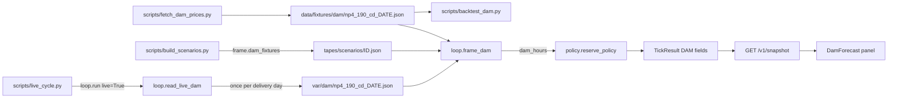

# Day-ahead price forecast (ERCOT DAM, NP4-190-CD)

**Decision (2026-09-27, user).** The Live wall shows the next 24 hours of ERCOT day-ahead (DAM) prices for each load zone, the hours each zone chose to charge in, and one line saying why it is charging or waiting. Every number on the panel is a field the engine already wrote on the tick; the wall and `/v1/snapshot` compute nothing. With no DAM hours on the tick, the panel is hidden. It never guesses and never borrows tape numbers.

The charging rule these numbers drive lives in [policy-intent.md, "Cheapest DAM hours"](policy-intent.md#cheapest-dam-hours) (with the backtest). The contract fields live in `CONSTRAINTS.md`. This file covers the panel, where its numbers come from, and the two scripts.

## The panel

`web/src/components/organisms/DamForecast.tsx`, titled "Next 24 h price (ERCOT DAM, $/MWh)", under `IntervalStrip` in `web/src/components/organisms/ControlBar.tsx` ([interval-strip.md](interval-strip.md)). Its pure math is `web/src/damForecast.ts`. It shows in Live, or in Archive when the tick carries `dam_hours`. Tokens only from `DESIGN.md`.

- One row per zone: one cell per hour, price as bar height. The chosen charge hours are Ink (charging is Ink, as on `/flow`). The current hour is outlined. A Muted hairline marks the zone's highest price.
- One line per zone from `zone_charge_why`. The shape, for example: "Houston · charging now · 2 cheapest hours of the next 24 · $14.10/MWh ERCOT DAM", "North · waiting · cheaper hour 03:00 · $11.20/MWh ERCOT DAM", "West · not charging · no later hour pays back". The exact copy lives in `damForecast.ts`.
- Every $/MWh carries its label (`CONSTRAINTS.md` invariant).

## Where each number comes from

| On the panel | Tick field | Source |
|---|---|---|
| Bar height and $/MWh | `dam_hours[zone][i].usd_mwh` | NP4-190-CD `settlementPointPrice` for `LZ_HOUSTON`, `LZ_NORTH`, `LZ_SOUTH`, `LZ_WEST` (`signal.ZONE_POINTS`), read by field name in `signal.read_dam_prices` |
| Hour cells | `dam_hours[zone][i].hour_start` | Central ISO hour start. `signal.dam_hour_start` turns hour-ending into a start; `DSTFlag` marks the repeated fall-back hour |
| Outlined cell | first entry of `dam_hours[zone]` | `signal.dam_window` starts at the hour holding the tick's clock |
| Ink cells | `zone_charge_hours[zone]` | `policy.dam_charge`, the chosen hours |
| "N cheapest hours" | `zone_hours_needed[zone]` | `fleet.zone_hours_needed` on the planner's view |
| Why line | `zone_charge_why[zone]` | `policy._set_zone_intent`: `dam_cheap_hour`, `rt_dip`, `cheaper_hour_later`, `no_payback`, `full`, `sell_band` |
| Source label | `dam_label`, `dam_as_of` | `loop.frame_dam`: `ercot` on Live, `recorded:ERCOT NP4-190-CD` on tapes, `none` without DAM; `dam_as_of` lists the delivery dates read |

**Window.** From the current hour up to 24 hours ahead, only hours already published at the tick. ERCOT posts the next day's DAM in the early afternoon; the engine treats it as out from 13:30 CT (`signal.DAM_POSTED_AT`, `dam_days_published`). So before 13:30 the window ends at midnight, and after it reaches into tomorrow. A zone missing the current hour is dropped from `dam_hours` and falls back to the $25/$60 bands.

**Stale.** On Live, `/v1/snapshot` passes the tick's DAM fields through and drops `dam_hours` when the tick is older than `stale_after_min` (90), so an old plan never reads as "the next 24 hours" and the panel hides. The other DAM fields stay. Detail: [wall-snapshot.md](wall-snapshot.md#day-ahead-fields).

## How the hours reach the tick



- **Tapes.** `TapeFrame.dam_fixtures` lists the day files published at that frame's clock (today's, plus tomorrow's from 13:30 CT). `scripts/build_scenarios.py` stamps it and adds the DAM rows to the provenance sidecar. `loop.frame_dam` reads the files (cached per path) and windows them. A replay needs no network.
- **Live.** `scripts/live_cycle.py` calls `loop.run(live=True)`. After `start_run`, if the outage fetch succeeded, `run` calls `read_live_dam(settings, clock)` with the first frame's clock. For each published day it reads `var/dam/np4_190_cd_YYYYMMDD.json`, or fetches that day with `signal.fetch_dam_prices` (its own ERCOT login, four GETs, one per load zone) and saves it. DAM prices are final once posted, so each day is fetched once.
- **Fixture store.** `data/fixtures/dam/`, one committed file per delivery day: `{source, delivery_date, fields, data}`, 96 rows (4 zones × 24 hours; a DST day has 23 or 25 hours per zone).
- **Live cache.** `var/dam/`, same file shape, gitignored. The live worker runs only on a laptop ([live-ingest.md, Where it runs](live-ingest.md#where-it-runs-checked-2026-09-27)), so the folder survives every cycle and a restart of `--loop`; a fresh clone starts empty and fetches today once. Nothing on Render reads or writes it. Proof: `tests/test_live_cycle.py` (a second cycle and a restarted worker make no DAM GET).

## Failure

| What fails | What happens |
|---|---|
| Outage fetch failed on Live (risk None) | No DAM read that cycle; every zone uses the $25/$60 bands. |
| One day's DAM fetch fails (ERCOT down, tomorrow not posted yet) | Logs `fetch_dam_prices failed` with a secret-free reason, prints `live: DAM <day> unknown`, and leaves that day out. It is not cached, so the next cycle tries again. If ERCOT posts late, Live runs on today's hours until tomorrow's arrive. |
| ERCOT rate-limits a DAM GET (HTTP 429) | `fetch_dam_prices` stops at that GET with `ERCOT DAM request failed (HTTP 429)`; it never retries. The day is not cached, so the next cycle (5 minutes later) makes one more attempt. |
| A day file is broken, or a tape names a missing file | Logs `stage=dam` failed; the tick has no DAM hours and uses the bands. |
| Tick older than `stale_after_min` on the wall | Snapshot drops `dam_hours`; the panel hides. |

## Scripts

Both read the root `.env`. Neither is called by the tick.

### `scripts/fetch_dam_prices.py`: save DAM days as fixtures

Setup: `ERCOT_USERNAME`, `ERCOT_PASSWORD` and `ERCOT_SUBSCRIPTION_KEY` in `.env`, and full network access to ERCOT (in a sandboxed agent shell, ask for full network).

```bash
python scripts/fetch_dam_prices.py 2026-08-30 2026-08-31    # named days
python scripts/fetch_dam_prices.py --scenarios              # every scenario day, plus the day after
python scripts/fetch_dam_prices.py --scenarios --force      # refetch days already saved
```

- Prints `wrote data/fixtures/dam/np4_190_cd_20260830.json: 96 rows`, or `kept ...` for a day already saved.
- Verify: the file has `source` `ERCOT NP4-190-CD dam_stlmnt_pnt_prices`, the right `delivery_date`, and 96 rows; `pytest -q tests/test_dam.py` passes.
- Failure: a day prints `failed <day>: <reason>` and the script exits 1. Reasons never contain secrets: `ERCOT credentials missing from .env`, `auth rejected (HTTP 401)`, `ERCOT DAM request failed (HTTP n)`, `ERCOT did not answer within 60 s`, `no DAM prices for <day>`. Days already saved are kept, so rerun with only the failed days. A fetch is all four zones or nothing, so a file is never half a day.

### `scripts/backtest_dam.py`: how good is DAM as a forecast?

Setup: `SUPABASE_URL` and `SUPABASE_SECRET_KEY` in `.env`, the DAM days saved by the script above, and the same days' real-time NP6-905-CD rows in Supabase `ercot_prices` (loaded by `scripts/load_ercot_reports.py`).

```bash
python scripts/backtest_dam.py               # every saved DAM day
python scripts/backtest_dam.py 2026-08-30    # one day
```

- Prints one row per day, zone and k (1 to 4): hit rate, then the average real-time $/MWh paid in the DAM-chosen hours, in hindsight's cheapest hours, and under the $25 band (`-` when fewer than k hours were at or under $25). Then one `all N zone-days, k=K: ...` summary per k. Results so far: [policy-intent.md, "Backtest"](policy-intent.md#backtest-is-dam-a-good-forecast-of-the-cheap-real-time-hours).
- Verify: `pytest -q tests/test_dam.py -k score_day`.
- Failure: it is a report and always exits 0. `backtest_dam_skipped: no_config` means the Supabase keys are missing. A day or zone it cannot score is listed as `skipped: no DAM file (run scripts/fetch_dam_prices.py <day>)`, `skipped: real-time prices incomplete in ercot_prices`, or `skipped: <fetch reason>`. It never fills a gap.

## Code

- `server/engine/signal.py`: `DAM_URL`, `DAM_SOURCE`, `DAM_HOURS_AHEAD`, `DAM_POSTED_AT`, `fetch_dam_prices`, `dam_days_published`, `dam_hour_start`, `read_dam_prices`, `dam_window`.
- `server/engine/loop.py`: `DAM_CACHE_DIR`, `read_live_dam`, `frame_dam`, `play_frame`, `run(live_dam=...)`.
- `server/engine/fleet.py`: `zone_hours_needed`. `server/engine/policy.py`: `dam_charge`. `server/engine/controller.py`: `acted_intent`.
- `server/api/snapshot.py`: Live passthrough and the stale drop.
- `web/src/damForecast.ts`, `web/src/components/organisms/DamForecast.tsx`, `web/tests/damForecast.test.ts`.
- Tests: `tests/test_dam.py`, `tests/test_live_cycle.py` (DAM cases), `tests/test_snapshot.py` (DAM cases), `tests/test_build_scenarios.py` (`dam_fixtures` stamping).

People page: `docs/humans/dam-forecast.md`.
