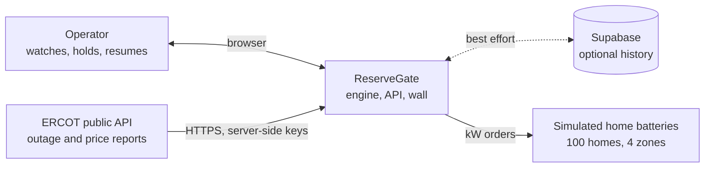
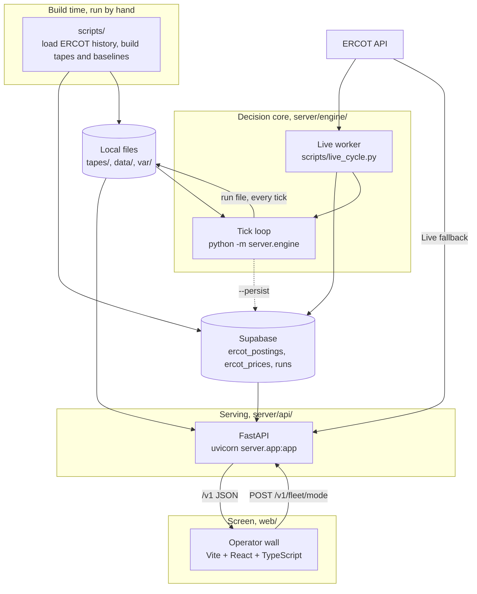
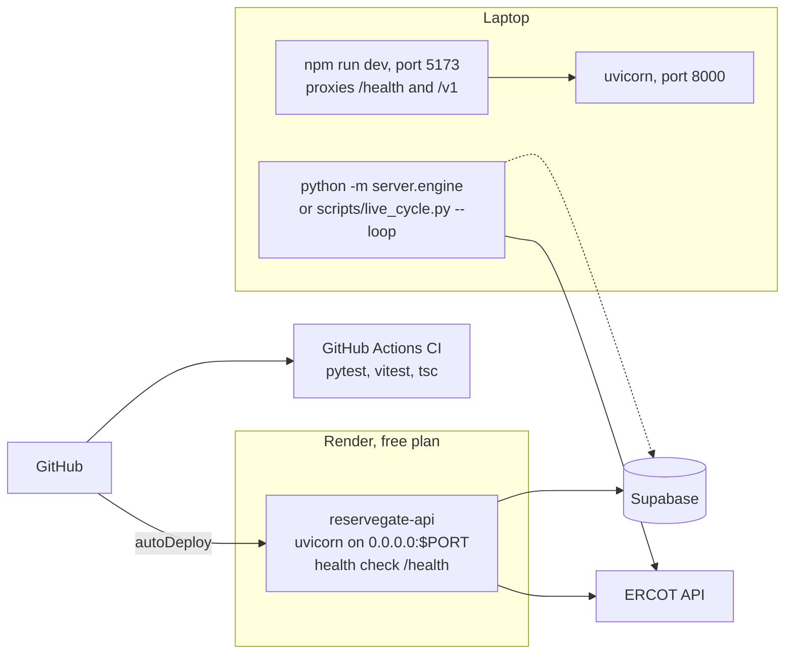

# System design

**Decision.** This file is the one home for how ReserveGate is built as a system: its parts, why each part exists, where data lives, how it fails, and how it is deployed. It is written so a person who has never seen the repo can read it top to bottom. Step-by-step code paths live in [code-flow.md](code-flow.md); this file links there instead of repeating them. Traced from the source on 2026-09-26.

**Keep it current.** Section 12 lists which change needs which doc update. `tests/test_system_design.py` fails when a setting, a dependency, a contract shape, or a Render service is added without a line here. The rule is `.cursor/rules/system-design.mdc`.

**New here? Read in this order.** Section 1 (the problem), section 2 (words we use), section 3 (the big picture), then [code-flow.md, "New here"](code-flow.md#new-here-one-tick-in-plain-words). That is about 15 minutes. Everything else is reference.

## 1. The problem in plain words

Base Power puts batteries in people's homes in Texas. When the grid is short of power, the grid operator (ERCOT) or a utility asks for power, and Base can sell energy from those batteries. The catch: each family still needs backup in case the grid fails, for example in a storm.

ReserveGate is a practice controller for that job. Every 5 minutes it:

1. Reads how stressed the grid looks, from a public ERCOT report.
2. Decides how much charge each home must keep back (the **reserve floor**).
3. Splits the grid's request across the homes, using only energy above each floor.
4. Records what it did and why, so an operator can watch and override.

The one-line rule: **"We may miss the target; we never break a reserve."** When the data is missing, late, or wrong, the system keeps more backup, not less.

The homes are simulated. Why we build it, and the non-negotiable principles: [PROJECT_CONTEXT.md](PROJECT_CONTEXT.md). What "done" looks like: [reservegate-summarized.md](reservegate-summarized.md), "Outcome".

## 2. Words we use

| Word | Meaning |
|---|---|
| ERCOT | The operator of most of the Texas grid. Publishes public reports we read. |
| Load zone | A region of the ERCOT grid. We use four: Houston, North, South, West. |
| NP3-233-CD | ERCOT's hourly report of how many MW of power plants are offline. Our grid-stress signal. |
| NP6-905-CD | ERCOT's 15-minute wholesale price per load zone, in $/MWh. |
| MW, kW, MWh, kWh | Power (how fast) and energy (how much). 1 MW = 1,000 kW. |
| SOC | State of charge: energy stored in a battery right now, in kWh. |
| Reserve floor | The share of a battery that must stay full for backup. 30% normally, 60% under storm risk (example settings). |
| Headroom | Energy above the floor. The only energy we may sell. |
| Target | The MW the grid asked for this tick. |
| Tick | One 5-minute pass of the controller. |
| Tape | A JSON file of ticks to replay (target, price, which ERCOT posting to read, events like a dead home). |
| Baseline | What the outage report usually looks like at each lead time, built from a past month. |
| Risk level | `HIGH` if the next 6 hours of outages are 15% above the baseline, else `LOW`. `None` if the report could not be read. |
| AUTO / HOLD | Operator mode. HOLD sends 0 kW to every home. |
| Intent | `charge`, `hold`, or `discharge`, picked from price and risk. A label on the tick; the allocator still only discharges. |
| Breach | A home discharged below its floor. Must always be 0. |
| Run file | `var/runs/<run_id>.json`. The engine's output and the source of truth. |
| Brief | One or two sentences explaining a tick, written after the decision. Nothing reads it to decide. |
| Wall | The operator screen, a React app in `web/`. |
| Snapshot | One tick prepared by the API for the wall (`GET /v1/snapshot`). |
| Fail safe | On bad input, keep the higher floor and log a reason. Never crash into a lower floor. |

## 3. The big picture

Who and what talks to ReserveGate:



The parts inside ReserveGate:



| Part | Job | Never does |
|---|---|---|
| `scripts/` | Pulls ERCOT history into Supabase and writes tapes, baselines, and evidence files. | Runs during a tick. |
| `server/engine/` | Rates risk, picks floors, splits the target, simulates the homes, scores the run, writes the run file. | Calls Supabase. Uses an LLM to decide. |
| `scripts/live_cycle.py` | Fetches the newest ERCOT posting, saves it to Supabase as `event=live`, and runs one engine tick with it. | Deletes archived history. |
| `server/api/` | Reads the run file, ERCOT, and Supabase, re-rates the posting with the engine's own functions, and serves `/v1` to the wall. | Allocates or writes a second risk rule. |
| `web/` | Shows the tick, the floors, the zones, data quality, and the brief. Sends HOLD and AUTO. | Calls ERCOT. Decides anything. |

How each part connects, file by file: [code-flow.md](code-flow.md), "At a glance" and "File map".

## 4. Design decisions and why

Each decision links to its home. The principles themselves are in [PROJECT_CONTEXT.md, Design principles](PROJECT_CONTEXT.md#design-principles-do-not-violate).

1. **Rules decide; language only explains.** Battery actions come from pure functions (`risk.compute_risk`, `policy.reserve_policy`, `controller.allocate`). The brief is built from the tick's fields afterwards. Why: every decision must be repeatable and explainable to a judge or an operator.
2. **Missing data counts as risk.** A failed, stale, or malformed ERCOT reading gives risk `None`, which gives the storm floor with reason `signal_unavailable`. Why: missing a target costs money; draining a home before a storm can leave a family dark. The two mistakes are not equal.
3. **The run file is the source of truth.** The engine writes `var/runs/<run_id>.json` and `var/runs/latest.json` after every tick. Supabase and the wall are copies or views. Why: the demo must work with no network, and one file is easy to inspect.
4. **Online helps, but is never required.** Supabase writes are best effort and print `..._skipped: <reason>`. The engine never imports Supabase. Why: a demo on venue Wi-Fi cannot depend on it.
5. **Pure core, thin edges.** `compute_risk` and `allocate` read no files, clock, or network. I/O sits in `signal.py`, `loop.py`, `events.py`, and the API. Why: the core is testable in milliseconds and cannot fail on the network.
6. **Two guards on the floor.** `allocate` plans only from headroom, and `fleet.discharge` clamps every order again. Both use `fleet.safe_kw`. Why: a bug in one layer still cannot breach a floor.
7. **Lead-matched baseline, not a fixed MW line.** ERCOT's report always looks calmer further ahead, because forced outages are not known days in advance. We compare hour +2 with what +2 usually looks like. Why: a fixed line fired on 88% of postings; this rule fires rarely. Numbers: [team-manifest.md](team-manifest.md).
8. **Zones react to weather only.** ERCOT HIGH or no signal raises every zone. A tape weather event raises only the warned zones. There is no per-zone ERCOT threshold. Contract: [CONSTRAINTS.md, Zones](../../CONSTRAINTS.md#zones).
9. **Contracts only grow.** Shared shapes live in `server/engine/contracts.py`. Fields may be added, never renamed or removed, so the engine, API, and wall never break each other. Rule: [CONSTRAINTS.md](../../CONSTRAINTS.md).
10. **Operators act on the fleet, not one home.** HOLD and AUTO are fleet-wide. Why: per-home clicking does not scale and invites mistakes.

## 5. How the decisions are made

### Storm risk (`server/engine/risk.py`)

The engine reads one NP3-233-CD posting. For each of the next 6 hours it adds up offline MW across 3 outage categories in 4 zones. It divides each hour by the baseline for that lead time and picks the hour furthest above normal. If that hour is at or above baseline + 15%, risk is `HIGH`. The result also names the driving zone. Settings: `RISK_MARGIN_PCT`, `LOOKAHEAD_HOURS`.

### Reserve floor (`server/engine/policy.py`)

| Risk | Floor everywhere | Reason |
|---|---|---|
| `None` (no usable reading) | 60% | `signal_unavailable` |
| `HIGH` | 60% | `storm_risk_high` |
| `LOW` | 30%, except 60% in a zone under a weather warning | `normal`, or `weather_alert` for that zone |

The same function sets the intent from price: HOLD or a missing price is `hold`; HIGH or no signal may `charge` when cheap and never `discharge`; LOW charges below `CHARGE_BELOW_USD` and discharges above `DISCHARGE_ABOVE_USD`. Full contract: [CONSTRAINTS.md, Function contracts](../../CONSTRAINTS.md#function-contracts).

### Splitting the target (`server/engine/controller.py`)

The rule is in [CONSTRAINTS.md, Allocation rule](../../CONSTRAINTS.md#allocation-rule-must-be-sayable-out-loud). A worked example, with 20 kWh batteries, 5 kW max, 5-minute ticks:

- Home A holds 12 kWh. Home B holds 6.2 kWh. Home C is dead.
- **Normal floor, 30% = 6 kWh.** A has 6 kWh headroom, capped at 5 kW. B has 0.2 kWh headroom, which is 2.4 kW over 5 minutes. C gets 0 because we cannot hear it. Caps add to 7.4 kW.
  - Target 8 kW: caps are short, so both run at their cap. Delivered 7.4, missed 0.6, reasons `fleet_headroom_short`, `homes_dead:1`.
  - Target 3 kW: caps are more than enough, so each gets a share in proportion to its cap. A gives about 2.03 kW, B about 0.97 kW. Missed 0.
- **Storm floor, 60% = 12 kWh.** A and B have no headroom. Delivered 0, missed the whole target, reason `storm_reserve`. No breach.

### One tick end to end

The order of calls in one tick, and how the API rebuilds a tick for the wall, are in [code-flow.md, Full flow](code-flow.md#1-full-flow). Not repeated here.

## 6. Data

### Shapes (`server/engine/contracts.py`)

| Shape | What it is |
|---|---|
| `Home` | One battery: capacity, stored energy, max kW, status (`live`, `stale`, `dead`), zone. |
| `TapeFrame` | One tick of a tape: time, target, price, which outage posting to read, events. |
| `Policy` | The floors (fleet and per zone), the reason, the risk level, the intent. |
| `Allocation` | Signed kW per home (positive sells, negative charges), delivered MW, missed MW, reasons. |
| `TickResult` | Everything the tick decided and why. One per tick in the run file. |

The web copy is `web/src/contracts.ts`; `contracts.py` wins if they disagree. The run file shape is in [CONSTRAINTS.md, Engine output](../../CONSTRAINTS.md#engine-output-read-by-web).

### Where data lives

| Place | What | Lifetime |
|---|---|---|
| `tapes/` | Replay tapes: `demo.json` (hand-written, synthetic), `heather.json` (built from Supabase). | Committed |
| `data/` | Baselines, saved storm fixtures, evidence (`margin_check.json`), replay CSVs under `data/events/`. | Committed, except raw zips |
| `var/runs/` | Run files. The source of truth. | Local, gitignored |
| `var/logs/` | One JSONL event log per run, 7 fields per line. | Local, gitignored |
| `var/state.json` | Operator mode, `AUTO` or `HOLD`, shared by the API and the live engine. | Local, gitignored |
| `var/signal/` | Last good ERCOT bodies, for the stale-window fallback. | Local, gitignored |
| `var/fleet/rollups.json` | Zone counts and MW for large fleets. | Local, gitignored |
| Supabase `ercot_postings` | One row per ERCOT posting (archive weeks and `event=live`). | Remote, optional |
| Supabase `ercot_prices` | Zone prices, one row per zone per 15 minutes. | Remote, optional |
| Supabase `runs` | Copies of run files. | Remote, optional |

Who reads and writes each file, step by step: [code-flow.md, Data files per step](code-flow.md#4-data-files-per-step). Supabase rules: [PROJECT_CONTEXT.md, Supabase](PROJECT_CONTEXT.md#supabase-optional-history-never-required).

## 7. Run modes on the wall

| Mode | Data source | Clock |
|---|---|---|
| Demo, no event | `web/src/fixtures/layout-run.json`, the 12-tick demo tape | Pinned 12:00 CT |
| Demo with an event (`?event=beryl`, `heather`, `tuning-2026`) | Saved ERCOT posting from Supabase at the replay clock, rated by the API | Replay clock |
| Live | Newest `event=live` row from the worker, else ERCOT directly through the API | Wall clock, polled every 20 s |

How the mode is chosen and what each shows: [runtime-mode.md](runtime-mode.md).

## 8. What happens when something fails

| Failure | What the system does | Where |
|---|---|---|
| ERCOT outage feed times out, returns an error, or is malformed | Risk `None`, 60% floor everywhere, reason `signal_unavailable`, never discharge intent | `signal.py`, `policy.py`, `snapshot.py` |
| Outage posting older than 90 minutes | Treated as no signal (same as above), quality `stale` | `signal.py`, `feeds.py` |
| ERCOT keys missing or refused | Quality `auth`, fail safe as above | `feeds.py` |
| Price missing | Intent `hold` with `price_unavailable`. The floor does not change. | `policy.py` |
| Baseline file missing or too short | The run stops with `BaselineError`. A setup error, not "no signal". | `baseline.py` |
| A home goes dead or stale | It gets 0 kW. Reasons `homes_dead:n`, `homes_stale:n`. The rest keep working. | `controller.py` |
| Not enough headroom | Target missed, reason `fleet_headroom_short` or `storm_reserve`. Never a breach. | `controller.py` |
| Operator presses HOLD | 0 kW to every home, reason `operator_hold` | `controller.py`, `fleet_state.py` |
| Weather warning names an unknown zone | Ignored, reason `unknown_weather_zone`, logged | `loop.py` |
| Supabase down or unset | Engine unaffected. Writes print `..._skipped`. Live falls back to ERCOT; archive Demo fails safe. | `persist_run.py`, `archive.py` |
| API unreachable | Wall shows `api down · <reason>`. If Live never got a first snapshot, the wall falls back to Demo. | `web/src/api/health.ts`, `runtimeMode.ts` |
| API restarts (Render free plan sleeps) | In-memory state resets. `var/` is empty on a fresh Render instance, so the API reads Supabase `runs`, then `layout-run.json`. | `snapshot.py` |

## 9. Deployment and running



Commands a newcomer needs:

```bash
pip install -r requirements.txt
python -m server.engine --tape tapes/demo.json   # play the demo tape, writes var/runs/latest.json
uvicorn server.app:app --reload                  # API on http://localhost:8000, docs at /docs
cd web && npm install && npm run dev             # wall on http://localhost:5173
pytest -q                                        # Python tests
```

Other entry points: `python -m server.engine.cli --fixture` (rate one posting), `python scripts/live_cycle.py --loop` (Live worker), `python -m server.engine.orchestration --tape PATH --seed N` (lossy-channel runtime). Details: [code-flow.md, Other entry points](code-flow.md#2-other-entry-points). Render setup: [backend.md, Deploy on Render](backend.md#deploy-on-render). The wall itself is not deployed yet.

### Settings

Names and example values live in `.env.example`; `cli.read_settings()` and `server/env.py` read them. Values go in `.env` or `server/.env`, never in git.

| Setting | Controls |
|---|---|
| `ERCOT_USERNAME`, `ERCOT_PASSWORD`, `ERCOT_SUBSCRIPTION_KEY` | ERCOT API login. Server side only. |
| `SUPABASE_URL`, `SUPABASE_SECRET_KEY` | Optional history. Server side only. |
| `JEV_API_KEY` | Optional shadow weather question in `scripts/jev_shadow.py`. Nothing decides on it. |
| `RISK_MARGIN_PCT`, `LOOKAHEAD_HOURS` | The storm rule: margin over baseline, hours ahead. |
| `FETCH_TIMEOUT_S`, `STALE_AFTER_MIN` | Network timeout, and when a posting counts as too old. |
| `FLEET_SIZE`, `HOME_KWH`, `HOME_MAX_KW`, `HOME_START_SOC_MIN_PCT`, `HOME_START_SOC_MAX_PCT` | The simulated fleet. Example values, not Base specs. |
| `CALL_TARGET_MW` | The Live and archive target. Unset scales the demo peak with the fleet size. |
| `BASE_RESERVE_PCT`, `STORM_RESERVE_PCT` | The two floors. |
| `CHARGE_BELOW_USD`, `DISCHARGE_ABOVE_USD` | Price bands for intent. |
| `TICK_MINUTES` | Length of one tick. |
| `ZONES` | Load zones and their anchor counties. |

API-only settings (`PORT`, `CORS_ORIGINS`, `CONSOLE_SCENE`, `CONSOLE_FIXTURES_DIR`): [backend.md, Settings](backend.md#settings-environment-variables). Wall build setting: `VITE_API_BASE_URL`.

### Dependencies

Python: `requests`, `python-dotenv`, `pytest`, `fastapi`, `uvicorn`, `httpx2` (test client). Web: `react`, `react-dom`, `leaflet` (the zone map), `@fontsource/ibm-plex-sans`, built with Vite and tested with Vitest. A new dependency is its own gap and needs a line in [CONSTRAINTS.md, Backend](../../CONSTRAINTS.md#backend-server).

## 10. Security

- ERCOT and Supabase keys stay on the server (`server/.env` or the process env). The browser never sees them and never calls ERCOT.
- Keys are never printed, logged, or committed. `.env.example` holds names only.
- Every `POST` needs an `X-Operator-Id` header. A refused write returns `{ "error", "brief" }`.
- No write can return the fleet to `AUTO` over a bad reading.
- CORS allows only origins in `CORS_ORIGINS`.

## 11. How we test

- `pytest -q` covers the engine (risk, policy, allocate, discharge, invariants such as zero breaches on every tape), the API routes, and the scripts with no network. `tests/test_invariants.py` (seeded random worlds) and `tests/test_failures.py` (dead homes, lost reports, slow workers) break the orchestration runtime on purpose and check that no home goes below its floor.
- `cd web && npm test && npm run typecheck` covers the wall.
- CI (`.github/workflows/ci.yml`) runs both on every push and pull request.
- `tests/test_code_flow.py` and `tests/test_system_design.py` fail when these docs fall behind the code.

## 12. Keeping the docs current

Update the doc in the same pull request as the change. A reviewer should reject a PR that changes the system without its doc line.

| If your change... | Update |
|---|---|
| Adds, removes, or renames a module, entry point, data file, or call between modules | [code-flow.md](code-flow.md), including its diagrams |
| Adds a part of the system, a store, an external service, or a deploy target | This file, sections 3, 6, and 9, and their diagrams |
| Adds or renames a setting in `.env.example` | This file, section 9 |
| Adds a dependency | This file, section 9, and `CONSTRAINTS.md` |
| Adds a shape to `contracts.py` | This file, section 6 |
| Changes how a failure is handled | This file, section 8 |
| Changes a rule (risk, floor, allocation) | The contract in `CONSTRAINTS.md` first, then section 5 here |
| Changes what a person should know in one minute | [docs/humans/system-design.md](../humans/system-design.md) or [docs/humans/code-flow.md](../humans/code-flow.md) |

Then add an entry to [progress.md](progress.md). Known gaps between the code and the contracts are listed once, in [code-flow.md, Stubs and gaps](code-flow.md#5-stubs-and-gaps). The limits we say out loud are in [team-manifest.md](team-manifest.md).
