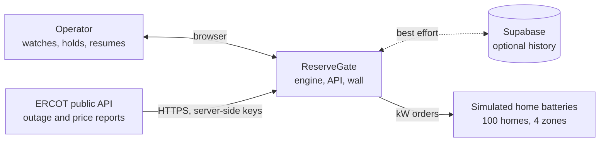
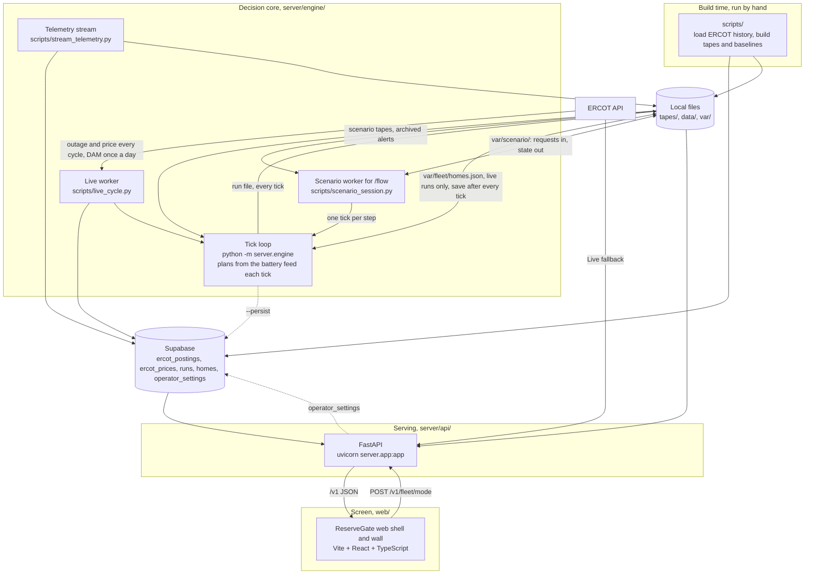
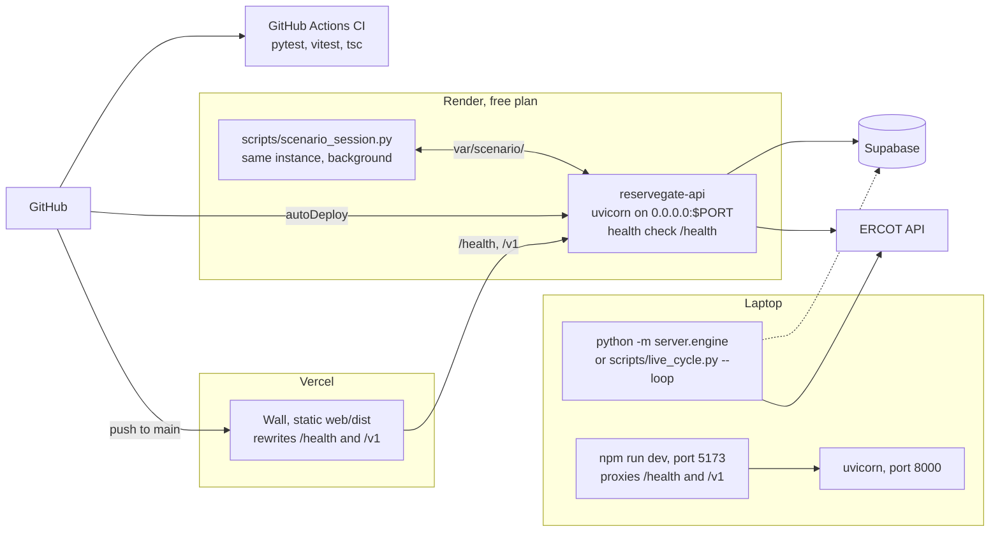

# System design

**Decision.** This file is the one home for how ReserveGate is built as a system: its parts, why each part exists, where data lives, how it fails, and how it is deployed. It is written so a person who has never seen the repo can read it top to bottom. Step-by-step code paths live in [code-flow.md](code-flow.md); this file links there instead of repeating them. Traced from the source on 2026-09-26.

**Keep it current.** Section 12 lists which change needs which doc update. `tests/test_system_design.py` fails when a setting, a dependency, a contract shape, or a Render service is added without a line here. The rule is `.cursor/rules/system-design.mdc`.

**New here? Read in this order.** Section 1 (the problem), section 2 (words we use), section 3 (the big picture), then [code-flow.md, "New here"](code-flow.md#new-here-one-tick-in-plain-words). That is about 15 minutes. Everything else is reference.

## 1. The problem in plain words

Base Power puts batteries in people's homes in Texas. When the grid is short of power, the grid operator (ERCOT) or a utility asks for power, and Base can sell energy from those batteries. The catch: each family still needs backup in case the grid fails, for example in a storm.

ReserveGate is a practice controller for that job. Every 5 minutes it:

1. Reads how stressed the grid looks, from a public ERCOT report.
2. Decides how much charge each home must keep back (the **reserve floor**).
3. Splits the grid's request across the homes, using only energy above each floor.
4. Records what it did and why, so an operator can watch and override.

The one-line rule: **"We may miss the target; we never break a reserve."** When the data is missing, late, or wrong, the system keeps more backup, not less.

The homes are simulated. Why we build it, and the non-negotiable principles: [PROJECT_CONTEXT.md](PROJECT_CONTEXT.md). What "done" looks like: [reservegate-summarized.md](reservegate-summarized.md), "Outcome".

## 2. Words we use

| Word | Meaning |
|---|---|
| ERCOT | The operator of most of the Texas grid. Publishes public reports we read. |
| Load zone | A region of the ERCOT grid. We use four: Houston, North, South, West. |
| NP3-233-CD | ERCOT's hourly report of how many MW of power plants are offline. Our grid-stress signal. |
| NP6-905-CD | ERCOT's 15-minute wholesale price per load zone, in $/MWh. |
| DAM (NP4-190-CD) | ERCOT's day-ahead price per load zone, one per hour, set the afternoon before. Zones charge in its cheapest upcoming hours. |
| MW, kW, MWh, kWh | Power (how fast) and energy (how much). 1 MW = 1,000 kW. |
| SOC | State of charge: energy stored in a battery right now, in kWh. |
| Reserve floor | The share of a battery that must stay full for backup. 30% normally, 60% under storm risk (example settings). |
| Headroom | Energy above the floor. The only energy we may sell. |
| Target | The MW the grid asked for this tick. |
| Tick | One 5-minute pass of the controller. |
| Tape | A JSON file of ticks to replay (target, price, which ERCOT posting to read, events like a dead home). |
| Baseline | What the outage report usually looks like at each lead time, built from a past month. |
| Risk level | `HIGH` if the next 6 hours of outages are 15% above the baseline, else `LOW`. `None` if the report could not be read. |
| AUTO / HOLD | Operator mode. HOLD sends 0 kW to every home. |
| Intent | `charge`, `hold`, or `discharge`, picked from price and risk. A label on the tick; the allocator still only discharges. |
| Breach | A home discharged below its floor. Must always be 0. |
| Confirmed MW | Power from orders a home answered before the tick's books close at 120 simulated seconds. Only confirmed MW counts as delivered. |
| Run file | `var/runs/<run_id>.json`. The engine's output and the source of truth. |
| Brief | One or two sentences explaining a tick, written after the decision. Nothing reads it to decide. |
| Wall | The operator screen, a React app in `web/`. |
| Snapshot | One tick prepared by the API for the wall (`GET /v1/snapshot`). |
| Fail safe | On bad input, keep the higher floor and log a reason. Never crash into a lower floor. |
## 3. The big picture

Who and what talks to ReserveGate:


```mermaid
flowchart LR
  OP["Operator<br/>watches, holds, resumes"]
  ERCOT["ERCOT public API<br/>outage and price reports"]
  SB[("Supabase<br/>optional history")]
  RG["ReserveGate<br/>engine, API, wall"]
  HOMES["Simulated home batteries<br/>100 homes, 4 zones"]

  OP <-->|"browser"| RG
  ERCOT -->|"HTTPS, server-side keys"| RG
  RG <-.->|"best effort"| SB
  RG -->|"kW orders"| HOMES
```

The parts inside ReserveGate:


```mermaid
flowchart TB
  subgraph offline["Build time, run by hand"]
    SCRIPTS["scripts/<br/>load ERCOT history, build tapes and baselines"]
  end

  subgraph core["Decision core, server/engine/"]
    ENGINE["Tick loop<br/>python -m server.engine<br/>plans from the battery feed each tick"]
    WORKER["Live worker<br/>scripts/live_cycle.py"]
    STREAM["Telemetry stream<br/>scripts/stream_telemetry.py"]
    SESSION["Scenario worker for /flow<br/>scripts/scenario_session.py"]
  end

  subgraph serve["Serving, server/api/"]
    API["FastAPI<br/>uvicorn server.app:app"]
  end

  subgraph ui["Screen, web/"]
    WALL["ReserveGate web shell and wall<br/>Vite + React + TypeScript"]
  end

  FILES[("Local files<br/>tapes/, data/, var/")]
  SB[("Supabase<br/>ercot_postings, ercot_prices, runs, homes, operator_settings")]
  ERCOT["ERCOT API"]

  SCRIPTS --> SB
  SCRIPTS --> FILES
  FILES --> ENGINE
  ERCOT -->|"outage and price every cycle, DAM once a day"| WORKER
  WORKER --> SB
  WORKER --> ENGINE
  STREAM --> SB
  STREAM --> FILES
  FILES -->|"scenario tapes, archived alerts"| SESSION
  SESSION -->|"one tick per step"| ENGINE
  SESSION <-->|"var/scenario/: requests in, state out"| FILES
  ENGINE -->|"run file, every tick"| FILES
  ENGINE <-->|"var/fleet/homes.json, live runs only, save after every tick"| FILES
  ENGINE -.->|"--persist"| SB
  FILES --> API
  SB --> API
  ERCOT -->|"Live fallback"| API
  API -->|"/v1 JSON"| WALL
  WALL -->|"POST /v1/fleet/mode"| API
  API -.->|"operator_settings"| SB
```

| Part | Job | Never does |
|---|---|---|
| `scripts/` | Pulls ERCOT history into Supabase and writes tapes, baselines, and evidence files. | Runs during a tick. |
| `server/engine/` | Rates risk, picks floors, splits the target, simulates the homes, scores the run, writes the run file. | Calls Supabase. Uses an LLM to decide. |
| `scripts/live_cycle.py` | Fetches the newest ERCOT posting, saves it to Supabase as `event=live`, and runs one engine tick with it. | Deletes archived history. |
| `scripts/stream_telemetry.py` | Writes a last-reading snapshot for the `FLEET_SIZE` homes (the emit file sizes it) and merge-upserts it onto `public.homes`. `--loop` keeps the feed moving. | Imports into the engine. Touches zone, status, or assigned_kw. |
| `scripts/scenario_session.py` | Plays one archive scenario for `/flow` a tick at a time with a seeded random fleet, applies operator requests (start, reset, alert, grid down), and writes `var/scenario/state.json`. Laptop, or beside uvicorn on Render. | Reads the network. Writes the run file or `var/fleet/`. |
| `server/api/` | Reads the run file, ERCOT, and Supabase, re-rates the posting with the engine's own functions, and serves `/v1` to the wall. Records `/flow` requests and reads the scenario state. | Allocates, writes a second risk rule, or runs a scenario tick. |
| `web/` | Shows the tick, the floors, the zones, data quality, and the brief. Sends HOLD and AUTO. `/`, `/live`, and `/fleet` mount the redesigned ReserveGate shell; `/flow` animates a scenario and sends its requests. | Calls ERCOT. Decides anything. |

How each part connects, file by file: [code-flow.md](code-flow.md), "At a glance" and "File map".

## 4. Design decisions and why

Each decision links to its home. The principles themselves are in [PROJECT_CONTEXT.md, Design principles](PROJECT_CONTEXT.md#design-principles-do-not-violate).

1. **Rules decide; language only explains.** Battery actions come from pure functions (`risk.compute_risk`, `policy.reserve_policy`, `controller.allocate`). The brief is built from the tick's fields afterwards. Why: every decision must be repeatable and explainable to a judge or an operator.
2. **Missing data counts as risk.** A failed, stale, or malformed ERCOT reading gives risk `None`, which gives the storm floor with reason `signal_unavailable`. Why: missing a target costs money; draining a home before a storm can leave a family dark. The two mistakes are not equal.
3. **The run file is the source of truth.** The engine writes `var/runs/<run_id>.json` and `var/runs/latest.json` after every tick. Supabase and the wall are copies or views. Why: the demo must work with no network, and one file is easy to inspect.
4. **Online helps, but is never required.** Supabase writes are best effort and print `..._skipped: <reason>`. The engine never imports Supabase. Why: a demo on venue Wi-Fi cannot depend on it.
5. **Pure core, thin edges.** `compute_risk` and `allocate` read no files, clock, or network. I/O sits in `signal.py`, `loop.py`, `events.py`, and the API. Why: the core is testable in milliseconds and cannot fail on the network.
6. **Two guards on the floor.** `allocate` plans only from headroom, and each home's worker in `orchestration.py` clamps its order again before it drains the battery. Both use `fleet.safe_kw`. Why: a bug in one layer still cannot breach a floor.
7. **Lead-matched baseline, not a fixed MW line.** ERCOT's report always looks calmer further ahead, because forced outages are not known days in advance. We compare hour +2 with what +2 usually looks like. Why: a fixed line fired on 88% of postings; this rule fires rarely. Numbers: [team-manifest.md](team-manifest.md).
8. **Zones react to weather only.** ERCOT HIGH or no signal raises every zone. A tape weather event raises only the warned zones. There is no per-zone ERCOT threshold. Contract: [CONSTRAINTS.md, Zones](../../CONSTRAINTS.md#zones).
9. **Contracts only grow.** Shared shapes live in `server/engine/contracts.py`. Fields may be added, never renamed or removed, so the engine, API, and wall never break each other. Rule: [CONSTRAINTS.md](../../CONSTRAINTS.md).
10. **Operators act on the fleet, not one home.** HOLD and AUTO are fleet-wide. Why: per-home clicking does not scale and invites mistakes.
11. **A replay starts fresh; only Live carries charge over.** A `--tape` or synthetic run starts from a new fleet and never reads or writes `var/fleet/homes.json`. A live run (`--live`, `scripts/live_cycle.py`) loads that file and saves it once after its last tick. Why: the same tape must give the same totals every time, while Live batteries must remember what they already gave. Detail: [fleet-rollups.md, Persist](fleet-rollups.md#persist).

## 5. How the decisions are made

### Storm risk (`server/engine/risk.py`)

The engine reads one NP3-233-CD posting. For each of the next 6 hours it adds up offline MW across 3 outage categories in 4 zones. It divides each hour by the baseline for that lead time and picks the hour furthest above normal. If that hour is at or above baseline + 15%, risk is `HIGH`. The result also names the driving zone. Settings: `RISK_MARGIN_PCT`, `LOOKAHEAD_HOURS`.

### Reserve floor (`server/engine/policy.py`)

| Risk | Floor everywhere | Reason |
|---|---|---|
| `None` (no usable reading) | 60% | `signal_unavailable` |
| `HIGH` | 60% | `storm_risk_high` |
| `LOW` | 30%, except 60% where a weather warning applies: a whole zone from a tape, or on `/flow` each county an active alert names (the zone's other counties stay at 30%) | `normal`, or `weather_alert` for that zone; county reasons in [CONSTRAINTS.md](../../CONSTRAINTS.md#function-contracts) |

The same function sets the intent from price: HOLD or a missing price is `hold`; HIGH or no signal may `charge` when cheap and never `discharge`; LOW charges below `CHARGE_BELOW_USD` and discharges above `DISCHARGE_ABOVE_USD`. When the tick carries DAM hours, a zone above its floor charges in its cheapest upcoming DAM hours instead of below `CHARGE_BELOW_USD`, and only if a later hour pays back the `ROUND_TRIP_PCT` loss ([policy-intent.md, "Cheapest DAM hours"](policy-intent.md#cheapest-dam-hours)). Full contract: [CONSTRAINTS.md, Function contracts](../../CONSTRAINTS.md#function-contracts).

### Splitting the target (`server/engine/controller.py`)

The rule is in [CONSTRAINTS.md, Allocation rule](../../CONSTRAINTS.md#allocation-rule-must-be-sayable-out-loud). A worked example, with 20 kWh batteries, 5 kW max, 5-minute ticks:

- Home A holds 12 kWh. Home B holds 6.2 kWh. Home C is dead.
- **Normal floor, 30% = 6 kWh.** A has 6 kWh headroom, capped at 5 kW. B has 0.2 kWh headroom, which is 2.4 kW over 5 minutes. C gets 0 because we cannot hear it. Caps add to 7.4 kW.
  - Target 8 kW: caps are short, so both run at their cap. Delivered 7.4, missed 0.6, reasons `fleet_headroom_short`, `homes_dead:1`.
  - Target 3 kW: caps are more than enough, so each gets a share in proportion to its cap. A gives about 2.03 kW, B about 0.97 kW. Missed 0.
- **Storm floor, 60% = 12 kWh.** A and B have no headroom. Delivered 0, missed the whole target, reason `storm_reserve`. No breach.

### One tick end to end

The order of calls in one tick, and how the API rebuilds a tick for the wall, are in [code-flow.md, Full flow](code-flow.md#1-full-flow). Not repeated here. Two points from it: with `TELEMETRY_FEED` on, every tick splits the target from what the simulated batteries reported, not from their true charge; and only a live run reads or writes `var/fleet/homes.json` (decision 11).

## 6. Data

### Shapes (`server/engine/contracts.py`)

| Shape | What it is |
|---|---|
| `Home` | One battery: capacity, stored energy, max kW, status (`live`, `stale`, `dead`), zone, and county (FIPS; set only on `/flow`). |
| `TapeFrame` | One tick of a tape: time, target, price, which outage posting to read, events, and which DAM day files were published (`dam_fixtures`). |
| `Policy` | The floors (fleet, per zone, and per county of an alerted zone), the reasons, the risk level, the intent, and for zones with DAM hours the chosen charge hours and why (`zone_charge_hours`, `zone_charge_why`). |
| `Allocation` | Signed kW per home (positive sells, negative charges), delivered MW, missed MW, reasons. |
| `TickResult` | Everything the tick decided and why. One per tick in the run file. With the battery feed on, it also carries `plant`, `feed` and `zone_telemetry`, built from what the batteries reported. `GET /v1/snapshot` sends `plant` and `feed` to the wall as `telemetry: {plant, readings}`, because the snapshot's own `feed` is the ERCOT status text. Confirmed charge is booked apart from delivery in `charging_mw` and `zone_charging_mw` (MW absorbed, never counted in `delivered_mw`). `grid_down_zones` lists the zones whose grid is down this tick; their batteries back up their own homes and neither sell nor charge. `county_reserve_pct` and `county_reasons` give each county of an alerted zone its floor and reason (named-county rule, [grid-flow.md](grid-flow.md#named-county-rule)). `dam_hours`, `dam_label`, `dam_as_of`, `zone_hours_needed`, `zone_charge_hours` and `zone_charge_why` carry the next 24 DAM hours and each zone's charge plan, which the Live wall's Next 24 h price panel shows ([dam-forecast.md](dam-forecast.md)). |

The web copy is `web/src/contracts.ts`; `contracts.py` wins if they disagree. The run file shape is in [CONSTRAINTS.md, Engine output](../../CONSTRAINTS.md#engine-output-read-by-web).

### Where data lives

| Place | What | Lifetime |
|---|---|---|
| `tapes/` | Replay tapes: `demo.json` (hand-written, synthetic), `heather.json` (built from Supabase), and `scenarios/` (the `/flow` tapes, their provenance sidecars, and `catalog.json`, built from Supabase). | Committed |
| `data/` | Baselines, saved storm fixtures, evidence (`margin_check.json`), replay CSVs under `data/events/`, archived NWS alerts (`fixtures/nws/`), and ERCOT DAM prices, one file per delivery day (`fixtures/dam/np4_190_cd_YYYYMMDD.json`, from `scripts/fetch_dam_prices.py`). | Committed, except raw zips |
| `var/runs/` | Run files. The source of truth. | Local, gitignored |
| `var/logs/` | One JSONL event log per run, 7 fields per line. | Local, gitignored |
| `var/state.json` | Operator mode, `AUTO` or `HOLD`, local cache for this process. | Local, gitignored |
| Supabase `operator_settings` | One fleet-wide HOLD / AUTO row so Render and the laptop worker share the mode. | Remote, optional |
| `var/signal/` | Last good ERCOT bodies, for the stale-window fallback. | Local, gitignored |
| `var/dam/` | Live DAM cache: one file per delivery day, fetched once and reused by every live cycle that day. | Local, gitignored, ephemeral (refetched after a restart) |
| `var/fleet/rollups.json` | Zone counts and MW for large fleets. Written every tick, read only by the API. | Local, gitignored |
| `var/fleet/homes.json` | Each home's charge, status, and zone. Written and read only by live runs, once per run; a tape replay never touches it. | Local, gitignored |
| `var/scenario/` | `/flow` inbox and output: `requests.json` (appended by the API), `state.json` (rewritten by the scenario worker), `logs/`. | Local, gitignored |
| Supabase `ercot_postings` | One row per ERCOT posting (archive weeks and `event=live`). | Remote, optional |
| Supabase `ercot_prices` | Zone prices, one row per zone per 15 minutes. | Remote, optional |
| Supabase `runs` | Copies of run files. | Remote, optional |
| Supabase `homes` | One current-state row per home (10k seeded; the API and Live use only the first `FLEET_SIZE`, see [demo-fleet.md](demo-fleet.md)). Row level security on, no policies: only the service role key reaches it. | Remote, optional |

Who reads and writes each file, step by step: [code-flow.md, Data files per step](code-flow.md#4-data-files-per-step). Supabase rules: [PROJECT_CONTEXT.md, Supabase](PROJECT_CONTEXT.md#supabase-optional-history-never-required).

## 7. Run modes on the wall

| Mode | Data source | Clock |
|---|---|---|
| Demo, no event | `web/src/fixtures/layout-run.json`, the 12-tick demo tape | Pinned 12:00 CT |
| Demo with an event (`?event=beryl`, `heather`, `tuning-2026`) | Saved ERCOT posting from Supabase at the replay clock, rated by the API | Replay clock |
| Live | Newest `event=live` row from the worker, else ERCOT directly through the API | Wall clock, polled every 20 s |

How the mode is chosen and what each shows: [runtime-mode.md](runtime-mode.md).

## 8. What happens when something fails

| Failure | What the system does | Where |
|---|---|---|
| ERCOT outage feed times out, returns an error, or is malformed | Risk `None`, 60% floor everywhere, reason `signal_unavailable`, never discharge intent | `signal.py`, `policy.py`, `snapshot.py` |
| Outage posting older than 90 minutes | Treated as no signal (same as above), quality `stale` | `signal.py`, `feeds.py` |
| ERCOT keys missing or refused | Quality `auth`, fail safe as above | `feeds.py` |
| Price missing | Intent `hold` with `price_unavailable`. The floor does not change. | `policy.py` |
| DAM fetch fails, tomorrow is not posted yet, or a DAM file is broken | That day is left out (logged `fetch_dam_prices failed` or `stage=dam`) and tried again next live cycle. Zones without DAM hours use the `CHARGE_BELOW_USD` / `DISCHARGE_ABOVE_USD` bands. | `loop.py`, `signal.py` |
| Baseline file missing or too short | The run stops with `BaselineError`. A setup error, not "no signal". | `baseline.py` |
| A home goes dead or stale | It gets 0 kW. Reasons `homes_dead:n`, `homes_stale:n`. The rest keep working. | `controller.py` |
| Not enough headroom | Target missed, reason `fleet_headroom_short` or `storm_reserve`. Never a breach. | `controller.py` |
| An order or a home's answer is lost on the simulated network | Retry at 60 s with the same id, reassign the work to another home, close at 120 s. An order never answered is `unconfirmed` and not counted as delivered; reasons such as `timed_out:n`. | `orchestration.py`, `channel.py` |
| Operator presses HOLD | 0 kW to every home, reason `operator_hold`. The wall writes `var/state.json` and `public.operator_settings`; the live worker hydrates the table onto the local file before allocate. | `controller.py`, `fleet_state.py`, `operator_settings.py` |
| Weather warning names an unknown zone | Ignored, reason `unknown_weather_zone`, logged | `loop.py` |
| A zone's grid is down (`events["grid_down"]`) | Its homes get 0 kW both ways and back up their own homes; reason `grid_down:<zone>`. An unknown zone name stops the tick with `ValueError`. | `controller.py`, `orchestration.py` |
| `/flow` scenario worker not running, or a tick fails | The page says the worker is not running (state older than 10 s), or names the failed tick and stops playback; the worker keeps serving. | `scenario.py`, `scenario_session.py` |
| Supabase down or unset | Engine unaffected. Writes print `..._skipped`. Live falls back to ERCOT; archive Demo fails safe. Mode stays on the local `var/state.json` of the process that wrote it. | `persist_run.py`, `archive.py`, `operator_settings.py` |
| API unreachable | Wall shows `api down · <reason>`. If Live never got a first snapshot, the wall falls back to Demo. | `web/src/api/health.ts`, `runtimeMode.ts` |
| API restarts (Render free plan sleeps) | In-memory state resets. `var/` is empty on a fresh Render instance, so the API reads Supabase `runs`, then `layout-run.json`. | `snapshot.py` |

## 9. Deployment and running


```mermaid
flowchart LR
  subgraph laptop["Laptop"]
    ENG["python -m server.engine<br/>or scripts/live_cycle.py --loop"]
    DEVAPI["uvicorn, port 8000"]
    DEVWEB["npm run dev, port 5173<br/>proxies /health and /v1"]
    DEVWEB --> DEVAPI
  end
  subgraph render["Render, free plan"]
    RAPI["reservegate-api<br/>uvicorn on 0.0.0.0:$PORT<br/>health check /health"]
    RSESS["scripts/scenario_session.py<br/>same instance, background"]
    RSESS <-->|"var/scenario/"| RAPI
  end
  subgraph vercel["Vercel"]
    VWALL["Wall, static web/dist<br/>rewrites /health and /v1"]
  end
  SB[("Supabase")]
  ERCOT["ERCOT API"]
  GH["GitHub"]
  CI["GitHub Actions CI<br/>pytest, vitest, tsc"]

  ENG -.-> SB
  ENG --> ERCOT
  RAPI --> SB
  RAPI --> ERCOT
  VWALL -->|"/health, /v1"| RAPI
  GH --> CI
  GH -->|"autoDeploy"| RAPI
  GH -->|"push to main"| VWALL
```

Commands a newcomer needs:

```bash
pip install -r requirements.txt
python -m server.engine --tape tapes/demo.json   # play the demo tape, writes var/runs/latest.json
uvicorn server.app:app --reload                  # API on http://localhost:8000, docs at /docs
cd web && npm install && npm run dev             # wall on http://localhost:5173
pytest -q                                        # Python tests
```

Other entry points: `python -m server.engine.cli --fixture` (rate one posting), `python scripts/live_cycle.py --loop` (Live worker), `python scripts/stream_telemetry.py --loop` (`FLEET_SIZE` last-reading stream onto `public.homes`), `python -m server.engine.orchestration --tape PATH --seed N` (lossy-channel runtime), `python scripts/fetch_dam_prices.py` and `python scripts/backtest_dam.py` (save ERCOT DAM days, and score DAM against real-time; [dam-forecast.md, Scripts](dam-forecast.md#scripts)), `python scripts/scenario_session.py` (the `/flow` scenario worker; on Render it starts beside uvicorn in the same instance, see [grid-flow.md, Run it on Render](grid-flow.md#run-it-on-render)). Details: [code-flow.md, Other entry points](code-flow.md#2-other-entry-points). Render setup: [backend.md, Deploy on Render](backend.md#deploy-on-render). The wall deploys to Vercel from `main` and reaches the API through rewrites in `web/vercel.json`: [backend.md, Deploy the wall on Vercel](backend.md#deploy-the-wall-on-vercel).
### Settings

Names and example values live in `.env.example`; `cli.read_settings()` and `server/env.py` read them. Values go in `.env` or `server/.env`, never in git.

| Setting | Controls |
|---|---|
| `ERCOT_USERNAME`, `ERCOT_PASSWORD`, `ERCOT_SUBSCRIPTION_KEY` | ERCOT API login. Server side only. |
| `SUPABASE_URL`, `SUPABASE_SECRET_KEY` | Optional history. Server side only. |
| `SUPABASE_DB_PASSWORD` | Optional. DDL only (CREATE TABLE). Not the Data API secret. |
| `RISK_MARGIN_PCT`, `LOOKAHEAD_HOURS` | The storm rule: margin over baseline, hours ahead. |
| `FETCH_TIMEOUT_S`, `STALE_AFTER_MIN` | Network timeout, and when a posting counts as too old. |
| `FLEET_SIZE`, `HOME_KWH`, `HOME_MAX_KW`, `HOME_START_SOC_MIN_PCT`, `HOME_START_SOC_MAX_PCT` | The simulated fleet. Example values, not Base specs. |
| `CALL_TARGET_MW` | The Live and archive target. Unset scales the demo peak with the fleet size. |
| `BASE_RESERVE_PCT`, `STORM_RESERVE_PCT` | The two floors. |
| `CHARGE_BELOW_USD`, `DISCHARGE_ABOVE_USD` | Price bands for intent. |
| `ROUND_TRIP_PCT` | Share of energy a battery gives back (89, Powerwall 3 datasheet; an example, not a Base spec). The DAM payback test. Rule: [CONSTRAINTS.md, Stale data](../../CONSTRAINTS.md#stale-data). |
| `TICK_MINUTES` | Length of one tick. |
| `CHANNEL_DROP_RATE`, `CHANNEL_DUP_RATE`, `CHANNEL_LATE_RATE` | Simulated bad network for every tick, 0 to 1 (default 0, clean). A tape `network` event overrides them for one tick. |
| `TELEMETRY_FEED`, `TELEMETRY_EVERY_S`, `TELEMETRY_STALE_AFTER_S`, `TELEMETRY_DEAD_AFTER_S` | Simulated battery feed: on unless `0`; one reading per home every 10 s; a home is stale after 180 s and dead after 600 s without a reading. Example values. Detail: [telemetry-vpp.md](telemetry-vpp.md). |
| `ZONES` | Load zones and their anchor counties. |

API-only settings (`PORT`, `CORS_ORIGINS`, `CONSOLE_SCENE`, `CONSOLE_FIXTURES_DIR`): [backend.md, Settings](backend.md#settings-environment-variables). Wall build setting: `VITE_API_BASE_URL`.

### Dependencies

Python: `requests`, `python-dotenv`, `pytest`, `fastapi`, `uvicorn`, `httpx2` (test client). Web: `react`, `react-dom`, `leaflet` (the zone map), `@fontsource/ibm-plex-sans`, `@fontsource/overpass` (redesign shell font), `three`, and `@react-three/fiber` v9 (future 3D replay views for React 19), built with Vite and tested with Vitest. A new dependency is its own gap and needs a line in [CONSTRAINTS.md, Backend](../../CONSTRAINTS.md#backend-server).

## 10. Security

- ERCOT and Supabase keys stay on the server (`server/.env` or the process env). The browser never sees them and never calls ERCOT.
- Keys are never printed, logged, or committed. `.env.example` holds names only.
- Supabase `homes` has row level security on with no policies, so the public (anon) key reads nothing. The server uses the service role key, which bypasses it.
- Every `POST` needs an `X-Operator-Id` header. A refused write returns `{ "error", "brief" }`.
- No write can return the fleet to `AUTO` over a bad reading.
- CORS allows only origins in `CORS_ORIGINS`.

## 11. How we test

- `pytest -q` covers the engine (risk, policy, allocate, discharge, invariants such as zero breaches on every tape), the API routes, and the scripts with no network. `tests/test_invariants.py` (seeded random worlds) and `tests/test_failures.py` (dead homes, lost reports, slow workers) break the orchestration runtime on purpose and check that no home goes below its floor.
- `cd web && npm test && npm run typecheck` covers the wall.
- CI (`.github/workflows/ci.yml`) runs both on every push and pull request.
- `tests/test_code_flow.py` and `tests/test_system_design.py` fail when these docs fall behind the code.

## 12. Keeping the docs current

Update the doc in the same pull request as the change. A reviewer should reject a PR that changes the system without its doc line.

| If your change... | Update |
|---|---|
| Adds, removes, or renames a module, entry point, data file, or call between modules | [code-flow.md](code-flow.md), including its diagrams |
| Adds a part of the system, a store, an external service, or a deploy target | This file, sections 3, 6, and 9, and their diagrams |
| Adds or renames a setting in `.env.example` | This file, section 9 |
| Adds a dependency | This file, section 9, and `CONSTRAINTS.md` |
| Adds a shape to `contracts.py` | This file, section 6 |
| Changes how a failure is handled | This file, section 8 |
| Changes a rule (risk, floor, allocation) | The contract in `CONSTRAINTS.md` first, then section 5 here |
| Changes what a person should know in one minute | [docs/humans/system-design.md](../humans/system-design.md) or [docs/humans/code-flow.md](../humans/code-flow.md) |

Then add an entry to [progress.md](progress.md). Known gaps between the code and the contracts are listed once, in [code-flow.md, Stubs and gaps](code-flow.md#5-stubs-and-gaps). The limits we say out loud are in [team-manifest.md](team-manifest.md).
