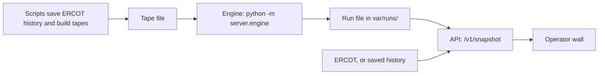

# How a run flows through the code

Scripts run ahead of time. They save ERCOT history in Supabase and turn it into tapes.

The engine plays a tape. For each tick it rates storm risk, picks how much charge each home keeps back, splits the grid's request across the homes, and writes one run file.

The API reads that run file, checks the newest ERCOT posting (or a saved one in Demo), and hands the wall one tick. The wall asks again every 20 seconds.

The run file ends with run totals: energy delivered against the target, floor breaches, and hold ticks.

Still placeholders: the tape reader and weather alerts.

More detail for agents: `docs/agents/code-flow.md`.
