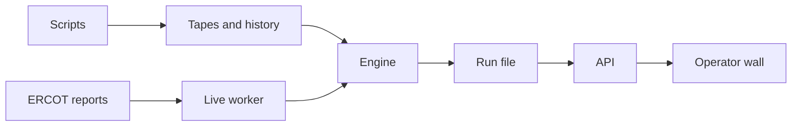

# How ReserveGate is built

The engine is the brain. Every 5 minutes it reads how stressed the grid is, sets how much charge each home keeps, and splits the grid's request across the homes.

If the data is missing or late, homes keep more charge. We may miss the target. We never break a reserve.

The engine writes a run file. That file is the truth. The API reads it and gives the wall one tick. The wall only shows it and sends Hold or Auto.

Supabase keeps history. If it is down, nothing stops.

Full design, with a glossary: `docs/agents/system-design.md`. Step by step through the code: `docs/agents/code-flow.md`.
