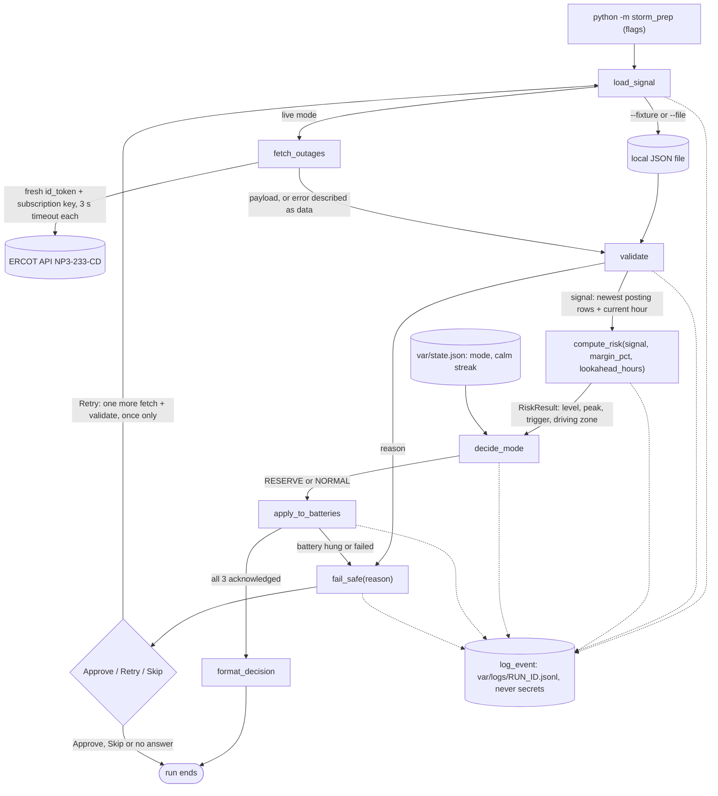

# Plan: Storm Prep Signal

Status: **Approved decisions recorded 2026-09-25 (third round). Slice 1 code has not started.**
Source facts: `docs/research.md`. Rules: `AGENTS.md`.

## Goal

This is a Python 3.13 CLI (the installed `.venv`). Each run does these steps once:

1. Read ERCOT's hourly outage capacity report (NP3-233-CD).
2. Compare the peak outage in the next few hours against a **relative** trigger: the
   posting's typical outage level plus a margin. The result is a risk level, HIGH or LOW.
3. Set 3 simulated batteries to RESERVE (risk HIGH) or NORMAL (risk LOW).

Anything uncertain goes to `fail_safe(reason)`. That puts every battery on RESERVE, logs the
reason, and asks a human to Approve, Retry or Skip (A/R/S). Retry means exactly one more
fetch and validate. Going back to NORMAL takes two calm readings in a row.

HIGH/LOW always describes **risk**. RESERVE/NORMAL always describes the **battery mode**.

## Data flow (the finished system, after all slices)



## Functions

The names in AGENTS.md are fixed. `format_decision` was added by the owner, and
`to_signal` is proposed by the agent (see Slice 1).

| Function | Module | Pure? | Job | Slice |
| --- | --- | --- | --- | --- |
| `load_signal(args, now)` | `storm_prep/signal.py` | no | Picks the source: `--fixture`, `--file`, or live `fetch_outages`. Returns the raw payload (or error data) and the clock to use. | 1 (files), 2 (live) |
| `to_signal(raw, now)` | `storm_prep/signal.py` | yes | Builds the `signal` dict from the raw payload. Rows are read by field **name**. | 1 |
| `fetch_outages(settings)` | `storm_prep/signal.py` | no | Gets a fresh token, then calls the report. **The only try/except for network errors.** It turns every failure into `{"error": "<kind>", "detail": "..."}`. | 2 |
| `validate(raw, now, lookahead_hours)` | `storm_prep/signal.py` | no clock inside (`now` is passed in) | Checks the rules in "Validation", then calls `to_signal`. Returns `(signal, None)` or `(None, reason)`. | 3 |
| `compute_risk(signal, margin_pct=20, lookahead_hours=6)` | `storm_prep/risk.py` | **yes** | Applies the risk rule. Returns a `RiskResult`. | 1 |
| `decide_mode(risk, state)` | `storm_prep/risk.py` | **yes** | Slice 1: risk HIGH gives RESERVE and LOW gives NORMAL. Slice 5 adds the calm streak. | 1, 5 |
| `apply_to_batteries(mode, batteries)` | `storm_prep/batteries.py` | no | Sets each of the 3 simulated batteries and collects acknowledgements. | 1 (simple), 4 (faults) |
| `format_decision(mode, risk, posted_at, now, source, quality)` | `storm_prep/decision.py` | yes | Builds the decision line. | 1 |
| `fail_safe(reason)` | `storm_prep/safety.py` | no | Sets every battery to RESERVE, logs the reason, prompts A/R/S. | 2 (minimal), 3 (full) |
| `log_event(stage, event, ok=True, reason=None, **data)` | `storm_prep/events.py` | no | Appends one JSON line to the run's log file. Never records headers, tokens or credentials. | 1 |

`signal` is a plain dict:

- `posted_at`: the newest `postedDatetime`, as an `America/Chicago` datetime (via `zoneinfo`).
- `current_date` and `current_hour_ending`: the hour being rated. These come from `now`,
  so `compute_risk` never reads a clock.
- `rows`: the rows of the newest posting only, in time order. Each row is a dict built by
  field name from `fields`, never by column position.

## Risk rule (decided 2026-09-25)

`compute_risk(signal, margin_pct=20, lookahead_hours=6)` is one deterministic, pure function.

1. `hour_total` for a row = the sum of the 12 fields `totalResourceMWZone*`,
   `totalIRRMWZone*` and `totalNewEquipResourceMWZone*` across South, North, West and Houston.
2. The **current hour** is the row whose `operatingDate` and `hourEnding` match
   `current_date` and `current_hour_ending`.
3. **Window** = the current hour through current hour + `lookahead_hours` − 1 (6 rows by default).
4. **Peak** = the row in the window with the largest `hour_total`. It gives `peak_mw` and `peak_hour`.
5. **Baseline**: `baseline_mw` = the median `hour_total` of **all rows from the current hour
   through the end of the posting**. It is not a fixed 168 rows.
6. `trigger_mw = baseline_mw * (1 + margin_pct / 100)`.
7. `margin_mw = peak_mw - trigger_mw`. It is negative when the peak is below the trigger.
8. `level = "HIGH"` if `peak_mw >= trigger_mw`, else `"LOW"`. A peak exactly on the trigger counts as HIGH.
9. `zone_mw` = each zone's 3-field sum in the peak hour. `driving_zone` = the zone with the largest sum.

`RiskResult` fields: `level`, `peak_mw`, `peak_hour`, `baseline_mw`, `trigger_mw`,
`margin_mw`, `driving_zone`, `zone_mw`.

There is **no absolute MW threshold** anywhere in the code or config.

### Fixture numbers (step 0 and the baseline decision)

Real fixture `tests/fixtures/np3_233_cd.json`, posted `2026-09-25T12:00:47`:

- It has 192 rows, from `2026-09-24 HE24` to `2026-10-02 HE23`. Hourly totals: min 16,335,
  median 18,824.5, max 22,253 MW.
- The step 0 branch test chose Branch A under both readings of "hours 1–168". The
  third-round decision replaces the fixed 168-hour baseline with the rule above.
- With the clock pinned to 12:00:47, the current hour is `2026-09-25 HE13` and 179 rows run
  from there to the end of the posting.
  - Baseline 18,623 MW, so the trigger is 22,347.6 MW.
  - The window is HE13–HE18. The peak is 22,194 MW at HE15, and the driving zone is North.
  - Margin −153.6 MW, so risk **LOW** and the battery mode is **NORMAL**.

## Decision line

Every successful run prints one line. The values below are examples only:

```
[RESERVE] risk HIGH | peak outages 19,480 MW at HE14 (next 6 h) vs trigger 19,150 MW (+330 MW; week median 15,960 MW +20%) | driving zone: Houston 7,120 MW | data as of 11:00 CT (38 min old) | quality: ok | source: ERCOT NP3-233-CD
```

- A LOW risk uses the same line with `[NORMAL]` and a negative margin, for example `(-1,210 MW; ...)`.
- `format_decision` gets `now` passed in, because the data age needs the clock.
- The source label is one of:
  - `source: ERCOT NP3-233-CD` in live mode.
  - `source: fixture` for the real saved file.
  - `source: fixture (synthetic)` when the file has a top-level `_note` field.

## Validation (Slice 3; every failure goes to `fail_safe` with this reason)

| Check | Reason text |
| --- | --- |
| All 12 zone fields are present in `fields` | `schema changed: missing <field>` |
| The current hour and the rest of the look-ahead window exist in the posting | `current hour not in report` (approved) |
| At least 48 rows from the current hour on | `window too short` |
| Every MW value is numeric and >= 0 | names the field and the hour |
| `postedDatetime` is read as `America/Chicago` with `zoneinfo` (it has no offset); the data is stale if it is older than 90 min | `stale: <n> min old` |

- `--simulate poison` removes one zone field, so validation fails with `schema changed`.
- `--simulate timeout` makes `fetch_outages` return timeout error data without touching the network.

## Auth and secrets (Slice 2)

- Get a fresh `id_token` every run. Tokens last 1 hour and each run is one-shot, so there is no caching.
- The data call sends `Authorization: Bearer <id_token>` plus `Ocp-Apim-Subscription-Key`.
- Each of the two calls (token, data) has a **3-second** timeout (`FETCH_TIMEOUT_S`).
- A 401 on the data call becomes the reason `auth rejected`. Live mode never falls back to fixtures.
- Credentials live only in `.env`, which is git-ignored.
- `log_event` never records headers, tokens or credentials. A test serializes one event
  from a live-style run and asserts that no token or key substring appears in it.

## Event schema (fields may be added, never renamed)

The log is JSON Lines: one object per line, in `var/logs/<run_id>.jsonl`.

| Field | Type | Meaning |
| --- | --- | --- |
| `ts` | string | Local time, ISO 8601 with UTC offset, for example `2026-09-25T11:47:02-05:00` |
| `run_id` | string | Same for every event in one run, for example `20260925-114702` |
| `stage` | string | `run`, `load_signal`, `fetch_outages`, `validate`, `compute_risk`, `decide_mode`, `apply_to_batteries`, `fail_safe` or `prompt` |
| `event` | string | Short snake_case name: `started`, `ok`, `rejected`, `mode_set`, `entered`, `operator_choice`, `finished` |
| `ok` | bool | `false` for any failure |
| `reason` | string or null | Required when `ok` is false. Plain English |
| `data` | object | Details for that stage (for example, the `RiskResult` fields, mode, battery id, choice). **Never secrets, tokens or headers** |

## Settings (`.env`, names in `.env.example`)

- `ERCOT_USERNAME`, `ERCOT_PASSWORD`, `ERCOT_SUBSCRIPTION_KEY`: used only by `fetch_outages`, never logged.
- `RISK_MARGIN_PCT` (20): how far above the baseline the peak must be for risk HIGH.
- `LOOKAHEAD_HOURS` (6): how many hours, starting with the current hour, are in the window.
- `FETCH_TIMEOUT_S` (3): the timeout for each network call.
- `JEV_API_KEY`: **optional**, for a possible later add-on worker. It is not used in Slices 0–6
  and the code must never require it.

## Slices

Each slice is one thin, working, end-to-end path. Each slice keeps its diff under about
250 lines, runs `pytest -q`, and adds an entry to `docs/progress.md`.

### Slice 0: Research and plan (done)

- Wrote `docs/research.md`, `docs/plan.md` and `docs/progress.md`, set up `.gitignore` and
  `.env.example`, and saved the real fixture.

### Slice 1: Tracer bullet, fixture only

- `python -m storm_prep --fixture` reads `tests/fixtures/np3_233_cd.json`.
  `python -m storm_prep --file <path>` reads any saved response.
- In both file modes, the clock is pinned to the file's `postedDatetime`, so the run is
  repeatable. The log records that the clock was pinned.
- The pipeline is `load_signal` → `to_signal` → `compute_risk` → `decide_mode` (simple) →
  `apply_to_batteries` (simple, 3 in-memory batteries) → `format_decision`. Each step
  writes one event through `log_event`.
- There is no `validate` or `fail_safe` yet (they arrive in Slice 3). Only known fixture
  files are used, so an unexpected file just raises a Python error.
- Add `tests/fixtures/np3_spike_synthetic.json`:
  - It is a copy of the real fixture with a top-level `"_note"` saying it is synthetic and
    what was changed.
  - One hour inside the window is raised above the trigger. The plan is +500 MW on
    `totalResourceMWZoneHouston` at `2026-09-25 HE16`. That makes the hour total 22,539 MW,
    against a trigger of 22,347.6 MW; the baseline stays at 18,623 MW.
  - It must rate **HIGH**, set the batteries to **RESERVE**, and print
    `source: fixture (synthetic)`.
- Tests:
  - A peak exactly on `trigger_mw` gives HIGH (the boundary is `>=`).
  - A peak 1 MW below the trigger gives LOW.
  - A peak at hour 6 of the window (not the current hour) is still caught.
  - The real fixture gives the same decision line on every run.
  - The synthetic spike fixture gives HIGH, all batteries RESERVE, and the synthetic source label.

### Slice 2: Live ERCOT fetch

- `fetch_outages` follows "Auth and secrets":
  1. POST the token request, with credentials in the form body.
  2. GET the report for the newest posting only.
  3. Each call has a 3 s timeout.
- The single try/except turns timeout, connection error, 401 (`auth rejected`),
  403/429/5xx and non-JSON bodies into error data.
- Live mode never falls back to fixtures.
- A minimal `fail_safe(reason)` handles any error data: every battery goes to RESERVE, the
  reason is logged, and the exit code is 2. The prompt comes in Slice 3. This keeps
  "every failure goes to fail_safe" true from the first live call.
- Tests: a 401 gives `auth rejected` and RESERVE; the no-secrets-in-logs test. There is also
  one manual live run by the owner, recorded in `progress.md`.

### Slice 3: Validation, full fail_safe, A/R/S, simulations

- `validate()` gets every reason in "Validation".
- `fail_safe` gets the A/R/S prompt (approved 2026-09-25):
  - **A**: accept RESERVE and end.
  - **R**: exactly **one** more fetch + validate. If it passes, the run continues from
    `compute_risk`. If it fails, the batteries stay on RESERVE and there is no second retry.
  - **S**: keep RESERVE and end the run.
  - **No answer** (stdin closed or empty): stay on RESERVE and exit with code 2.
- `--simulate timeout` and `--simulate poison`.
- Tests:
  - A missing zone field gives `schema changed`.
  - 47 rows from the current hour on gives `window too short`.
  - A negative or non-numeric MW value is rejected.
  - A posting 91 min old gives stale.
  - A missing current hour gives `current hour not in report`.
  - Timeout and poison runs end in RESERVE.
  - The retry limit holds, and no answer exits 2.

### Slice 4: Battery faults

- `--hang-battery N` makes battery N (1–3) never acknowledge within the ack timeout.
- `--fail-battery N` makes battery N report an error.
- Either fault goes to `fail_safe`. Batteries that can't confirm RESERVE are listed in the
  log and in the prompt.
- Tests: both flags end in RESERVE with a reason that names the battery.

### Slice 5: Two calm readings to return to NORMAL

- `var/state.json` stores `mode` and `calm_streak` between runs. Only the CLI reads and
  writes it; `decide_mode` stays pure.
- The rules:
  - Risk HIGH: RESERVE, and the streak goes to 0.
  - Risk LOW while in RESERVE: the streak goes up by 1. When it reaches 2, switch to NORMAL.
  - Risk LOW while in NORMAL: stay NORMAL.
  - A fail-safe run sets RESERVE and resets the streak to 0.
- Tests: the sequences HIGH, LOW, LOW gives NORMAL; HIGH, LOW, HIGH, LOW stays RESERVE;
  fail-safe resets the streak.

### Slice 6: README and explanation details

- Add the driving zone's three field values to the `compute_risk` event (adding fields only).
- The README covers setup, `.env`, every flag, the decision line, reading logs, failure
  recovery, and the source of truth.

### Slice V (optional): Replay viewer

- `python -m storm_prep view <logfile>` prints the run's events as a readable timeline.
  It only reads.
- Tests: viewing a saved log from a Slice 4 fault run shows the fail-safe reason and the
  operator choice.

## Layout (created only as slices need it)

```
storm_prep/
  __main__.py      CLI flags and the run loop (with the single retry)
  signal.py        load_signal, to_signal, fetch_outages, validate
  risk.py          compute_risk, RiskResult, decide_mode (pure)
  decision.py      format_decision
  batteries.py     simulated batteries, apply_to_batteries
  safety.py        fail_safe, A/R/S prompt
  events.py        log_event
  viewer.py        slice V only
tests/
  fixtures/np3_233_cd.json             real response saved on 2026-09-25 (no token, no headers)
  fixtures/np3_spike_synthetic.json    Slice 1: synthetic spike, labeled in "_note"
var/               logs and state (git-ignored)
```

## Owner decisions

2026-09-25, first round:

1. **Total**: all three categories (Resource + IRR + NewEquip) across the 4 zones. The
   driving zone is the zone with the largest sum.
2. **`JEV_API_KEY`**: optional, for a later add-on worker. Not used in Slices 0–6 and never required.
3. **Python**: 3.13 (the installed `.venv`).
4. **Approved**: A/R/S (now in Slice 3), and the 90-minute staleness limit.

2026-09-25, second round (replaces the earlier threshold and single-hour decisions):

5. **Risk rule**: a relative trigger (baseline + `RISK_MARGIN_PCT`), with a
   `LOOKAHEAD_HOURS` window. `RISK_THRESHOLD_MW` is removed.
6. **Fixture clock**: pinned to the file's `postedDatetime`.
7. **Decision line, validation reasons, auth and the secrets test**: as written above.

2026-09-25, third round:

8. **Baseline**: the median of all rows from the current hour through the end of the
   posting. Validation needs at least 48 rows from the current hour on.
9. **Slice order**:
   - 1: fixture tracer bullet, with the synthetic spike fixture.
   - 2: live fetch and auth.
   - 3: validation, `fail_safe` and A/R/S, and the simulations.
10. **Approved**: `current hour not in report` as a validate reason; `compute_risk` stays pure.
